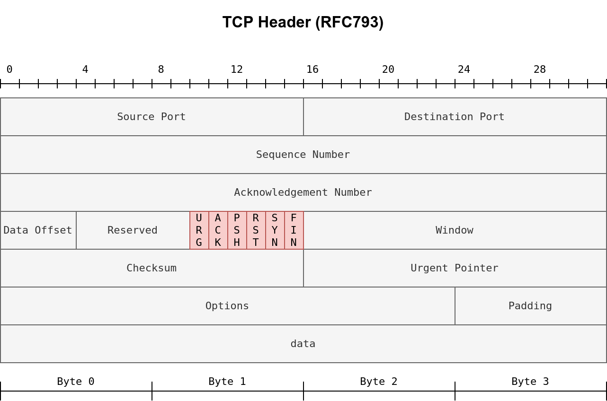

# Nmap Basic Port Scans

### TCP and UDP Ports

Port states:

1. Open: indicates a service is listening on the specified port

2. Closed: indicates that no service is listening on the specified port although it is 
accessible i.e. it's  reachable and not blocked by a firewall or other security 
appliances/programs.

3. Filtered: Nmap cannot determine if the port is open or closed because the port is not 
accessible. This state is usually due to a firewall preventing Nmap from reaching that port. 
Nmap’s packets may be blocked from reaching the port; alternatively, the responses are 
blocked from reaching Nmap’s host.

4. Unfiltered: Nmap cannot determine if the port is open or closed, although the port is 
accessible. This state is encountered when using an ACK scan `-sA`.

5. Open|Filtered: This means that Nmap cannot determine whether the port is open or filtered.

6. Closed|Filtered: This means that Nmap cannot determine whether the port is closed or
filtered.

### TCP Flags

The TCP header is the first 24 bytes of a TCP segment. [RFC 793](https://datatracker.ietf.org/doc/html/rfc793.html)

1. **URG**: Urgent flag indicates that the urgent pointer filed is significant. 
The urgent pointer indicates that the incoming data is urgent, and that a TCP segment with 
the URG flag set is processed immediately without consideration of having to wait on 
previously sent TCP segments.

2. **ACK**: Acknowledgement flag indicates that the acknowledgement number is 
significant. It is used to acknowledge the receipt of a TCP segment.

3. **PSH**: Push flag asking TCP to pass the data to the application promptly.

4. **RST**: Reset flag is used to reset the connection. Another device, such as a 
firewall, might send it to tear a TCP connection. This flag is also used when data is sent 
to a host and there is no service on the receiving end to answer.

5. **SYN**: Synchronize flag is used to initiate a TCP 3-way handshake and 
synchronize sequence numbers with the other host. The sequence number should be set randomly 
during TCP connection establishment.

6. **FIN**: Finish flag the sender has no more data to send.

### TCP Connect Scan

`namp -sT <TARGET-IP>`

Nmap completes the 3-way handshake, then as soon as the port's state is confirmed the 
connection is torn (Attacker:SYN, Target:SYN/ACK, Attacker:ACK, Attacker:RST/ACK).

### TCP SYN Scan

`nmap -sS <TARGET-IP>`

Nmap tears down the connection once it receives a response from the target(Attacker:SYN, 
Target:SYN/ACK, Attacker:RST).It doesn't establish a TCP connection, decreasing the chances 
of the scan being logged.

### UDP Scan

`nmap -sU <TARGET-IP>`

Nmap sends a UDP packet to the target port, if the port is open no response is expected.
If a port is closed, an ICMP Type 3 packet (destiantion unreachable) with a code 3 (port 
unreachable) is expected

### Fine-Tuning Scope and Performance

**Specify ports**

- Port list: `-p22,80,443` to scan ports 22, 80 and 443

- Port range: `-p1-1023` to scan all ports from 1 to 1023 inclusive

- All ports: `-p-`

- Most common ports: `-F` to scan the most common 100 ports

- Top ports: `--top-ports <N>` to scan the top n ports

**Scan timing/IDS alert evasion**

- Scan timing: `-T<0-5>` 0 = paranoid, 1 = sneaky, 2 = polite, 3 = normal, 4 = aggressive, 
5 = insane

- Packet rate: `--min-rate <n>` or `--max-rate <n>` to control min or max packets per second

- Probe paralellization: `--min-parallelism <n>` or `--max-parallelism <n>` to control min 
or max number of probes running in parallel
