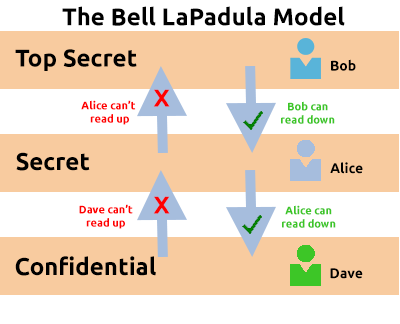

# Principles of Security

### The CIA Triad

#### Confidentiality 

The protection of data from unauthorized access and misuse. To provide confidentiality is 
to protect sensitive data from parties that it is not intended for.

#### Integrity 

Integrity is the condition where information is kept accurate and consistent unless 
authorized changes are made. Integrity is maintained when the information remains unchanged 
during storage, transmission, and usage not involving modification to the information. 
Steps must be taken to ensure data cannot be altered by unauthorised people (for example, 
in a breach of confidentiality).

#### Availability

In order for data to be useful, it must be available and accessible by the user.

The main concern in the CIA triad is that the information should be available when 
authorised users need to access it.

Availability is very often a key benchmark for an organisation. For example, having 99.99% 
uptime on their websites or systems (this is laid out in Service Level Agreements). When a 
system is unavailable, it often results in damage to an organisations reputation and loss 
of finances. Availability is achieved through a combination of many elements, including:

- Having reliable and well-tested hardware for their information technology servers (i.e. 
reputable servers)

- Having redundant technology and services in the case of failure of the primary

- Implementing well-versed security protocols to protect technology and services from attack

### Principles of Privilege

Privileged Identity Management (PIM): PIM is used to translate a user's role within an 
organisation into an access role on a system

Privileged Access Management (PAM): PAM is the management of the privileges a system's 
access role has, amongst other things.

### Security Models Continued

#### The Bell-La Padula Model

The Bell-La Padula Model is used to achieve confidentiality. This model has a few 
assumptions, such as an organisation's hierarchical structure it is used in, where 
everyone's responsibilities/roles are well-defined.

The model works by granting access to pieces of data (called objects) on a strictly need to 
know basis. This model uses the rule "no write down, no read up".

The Bell LaPadula Model is popular within organisations such as governmental and military. 
This is because members of the organisations are presumed to have already gone through a 
process called vetting. 

Pros:

- Policies in this model can be replicated to real-life organisations hierarchies

- Simple to implement and understand, and has been proved to be successful

Cons:

- Even though a user may not have access to an object, they will know about it's existence 
so it's not confidential in that aspect

- The model relies on a large amount of trust within the oraganisation

#### The Biba Model

The Biba model is arguably the equivalent of the Bell-La Padula model but for the integrity 
of the CIA triad.

This model applies the rule to objects (data) and subjects (users) that can be summarised 
as "no write up, no read down". This rule means that subjects can create or write content 
to objects at or below their level but can only read the contents of objects above the 
subject's level.

Pros:

- The model is simple to implement

- Resolves the limitations of the Bell-La Padula model by addressing both confidentiality 
and data integrity

Cons:

- There will be many levels of access and objects. Things can be easily overlooked when 
applying security controls

- Often results in delays within a business. For example, a doctor would not be able to 
read the notes made by a nurse at the hospital 

### Threat Modelling & Incident Response

Threat modelling: Process of reviewing, improving and testing security protocols in place 
in an organisation's information technology infrastructure and services.

- Identification

- Preparation

- Mitigation

- Review

An effective threat model includes:

- Threat intelligence

- Asset identification

- Mitigation capabilities

- Risk assessment

Frameworks:

**PASTA** (Process for Attack Simulation and Threat Analysis)

**STRIDE** (Spoofing identity, Tampering with data, Repudiation threats, Information 
disclosure, Denial of Service and Elevation of privileges)

- Spoofing identity: This principle requires you to authenticate requests and users 
accessing a system. Spoofing involves a malicious party falsely identifying itself as 
another. Access keys (such as API keys) or signatures via encryption helps remediate this 
threat.

- Tampering: Provide integrity to data through anti-tampering measures. Accessed data must 
be kept integral and accurate.

- Repudiation: Trace activity on a system or application through logging or other means.

- Information Disclosure: Configure applications or services correctly to only disclose 
information relevant to the owner.

- Denial of Service: Implement measures so the abuse of an appplication or service will not 
bring the whole system down

- Elevation of Privilege: Worst case scenario for an application or service. The attacker 
was able to gain a foothold and escalate their authorization to a higher level. This 
scenario often leads to further exploitation and information disclosure.

Security breaches are known as incidents. Actions taken to resolve and remediate the threat are known as Incident Response (IR).

**Incident Classification**

| Urgency \ Impact | High | Medium | Low |
|------------------|------|--------|-----|
|        High      |   1  |    2   |  3  |
|       Medium     |   2  |    3   |  4  |
|        Low       |   3  |    4   |  5  |

Incidents are responded to by Computer Security Incident Response Team (CSIRT)

**6 Phases of Incident Response**

- Preparation: Do we have resources and plans in place to deal with the security incident?

- Identification: Has the threat & threat actor been correctly identified in order for us 
to respond to?

- Containment: Can the threat/security incident be contained to prevent other systems or 
users from being impacted?

- Eradication: Remove the active threat.

- Recovery: Perform a full review of the impacted systems to return operations to business 
as usual.

- Lessons Learned: What can be learned from the incident?
