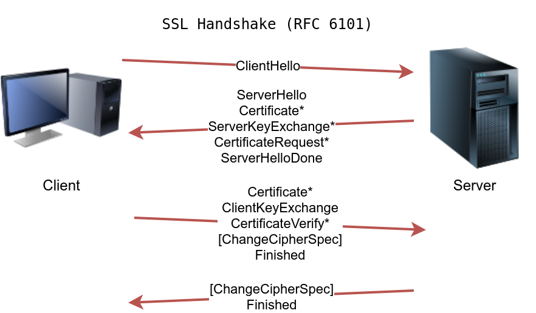

# Protocols and Servers 2

### Introduction

Confidentiality Integrity Availability and Disclosure Alteration Desctruction triads

### Sniffing Attack

Collecting information on a target with a network packet capture tool. Conducted using an 
Ethernet (802.3) network card and super user permissions on the system capturing packets.

Tcpdump, Wireshark and Tshark are common tools used to capture network packets. If we have 
access to the network traffic of a system (via a wiretap, a switch with port mirroring or a 
MITM attack) using a protool that communicates in cleartext we can sniff the packets and see
usernames, passwords and other useful information.

`sudo tcpdump port <PROTOCOL-PORT> -i <NETWORK-INTERFACE> -A` 

Using tcpdump to sniff packets of a specifed protocol on a specific interface displaying 
them in ASCII `-A`

### Man-in-the-Middle Attack - MITM

Occurs when the victim A believes to be communicating with the legitimate service B but is 
in fact communicating with the attacker E. A sends a request to B which is intercepted and 
modified by E who then passes it on to B.

[Ettercap](https://www.ettercap-project.org/) and [Bettercap](https://www.bettercap.org/) are common tools used to carry out MITM attacks.

Prevent these kind of attacks with authentication and cryptography

### Transport Layer Security - TLS

OSI layer 6 SSL/TLS, most modern servers use TLS. We can use TLS to upgrade protocols 
communicating in cleartext.

**Examples**

| Protocol | Default Port | Secured Protocol | Default Port with TLS |
|----------|--------------|------------------|-----------------------|
| HTTP     | 80           | HTTPS            | 443                   |
| FTP      | 21           | FTPS             | 990                   |
| SMTP     | 25           | SMTPS            | 465                   |
| POP3     | 110          | POP3S            | 995                   |
| IMAP     | 143          | IMAPS            | 993                   |

HTTP:

1. Establish a TCP connection
2. Send HTTP requests to the web server

HTTPS:

1. Establish a TCP connection
2. Establish SSL/TLS connection
3. Send HTTP requests to the web server

**SSL Handshake**

1. The client sends a ClientHello to the server to indicate its capabilities, such as 
supported algorithms.

2. The server responds with a ServerHello, indicating the selected connection parameters. 
The server provides its certificate if server authentication is required. The certificate is 
a digital file to identify itself; it is usually digitally signed by a third party. 
Moreover, it might send additional information necessary to generate the master key, in its 
ServerKeyExchange message, before sending the ServerHelloDone message to indicate that it is 
done with the negotiation.

3. The client responds with a ClientKeyExchange, which contains additional information 
required to generate the master key. Furthermore, it switches to use encryption and informs 
the server using the ChangeCipherSpec message.

4. The server switches to use encryption as well and informs the client in the 
ChangeCipherSpec message.

### Secure Shell - SSH

An SSH connection is secure, which can be summarized as:

1. You can confirm the identity of the remote server
2. Exchanged messages are encrypted and can only be decrypted by the intended recipient
3. Both sides can detect any modification in the messages

To use SSH you need an SSH server and an SSH client. The server listens on port 22 by default
and the client can authenticate using:

- A username and password
- A private and public key (after the SSH server is configured to recognize the 
corresponding public key)

SSH can be used to transfer files using Secure Copy Protocol (SCP) based on the SSH protocol

`scp <USERNAME>@<SSH-SERVER>:/path/to/file /copy/to/path` to receive files
`scp /path/to/file <USERNAME>@<SSH-SERVER>:/copy/to/path` to send files

### Password Attack

`hydra -l <USERNAME> -P <PASSWORD-WORDLIST> <TARGET-IP> <TARGET-SERVICE>`
`hydra -l <USERNAME> -P <PASSWORD-WORDLIST> <TARGET-SERVICE>://<TARGET-IP>`

`-V` or `-vV` to increase verbosity, `-s <PORT>` to specfiy non-default port, `-t n` to 
increase parallel connections where n is the thread count and `-d` for debugging.

Common password attacks

1. Password Guessing: Use knowledge of target to guess password e.g. pet's name, year of 
birth etc.

2. Dictionary Attack: Expands on password guessing, includes all valid words from the 
dictionary.

3. Brute Force Attack: The most exhaustive and time-consuming attack, can go as far as 
trying all possible character combinations which grows exponentiallly with the number of 
characters.

Mitigation against password attacks can be sophisticated and depends on the target system.

Examples:

- Password policy
- Account lockout
- Throttle authentication attempts
- Use CAPTCHA
- Require use of public certificate for authentication
- 2FA/MFA
- IP-based geolocation

