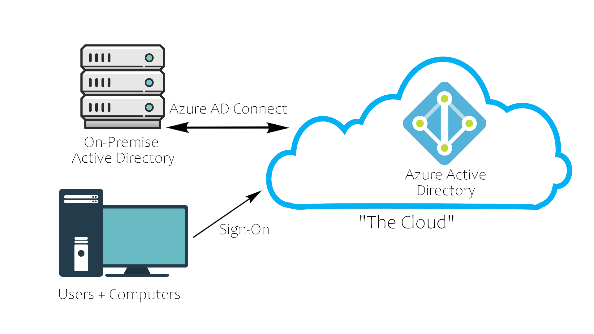

# Active Directory Basics

### Physical Active Directory

A Domain Controller is a Windows Server with Active Directory Services installed that has 
been promoted to a DC in the forest.

Domain Controllers:

- Holds the AD DS store

- Handles authentication and authorization

- Replicate  updates from other DCs in the forest

- Allows admin access to manage domain resources

AD DS - Actve Directory Data Store:

- Contains the NTDS.dit, a database containing all of the information of an Active 
Directory domain controller as well as password hashes for domain users

- Stored by default in %SystemRoot%\NTDS

- Accessible only by the DC

### The Forest

A Forest is a collection of one or more Domain trees insisde of an AD network.

Forest Overview:

- Trees - A hierarchy of domains in Active Directory Domain Services

- Domains - Used to group and manage objects

- Organizational Units (OUs) - Containers for groups, computers, users, printers and other 
OUs

- Trusts - Allow users to access resources in other domains

- Objects - users, groups, printers, shares and computers

- Domain Services - DNS Server, LLMNR, IPv6

- Domain Schema - Rules for object creation

### Users and Groups

Users Overview:

- Domain Admins - They control the domains and are the only ones with access to the DC

- Service Accounts (Can de Domain Admins) - For the most part never used except for service 
maintenance, they are required by Windows for services such as SQL to pair a service with a 
service account

- Local Administrators - Can make changes to local machines as an administrator and may 
even be able to control other normal users, but they cannot access the domain controller

- Domain Users - Everyday users. They can log in on the machines they have the 
authorization to access and may have local administrator rights to machines depending on 
the organization.

Groups Overview:

- Security Groups - These groups are used to specify permissions for a large number of users

- Distribution Groups - These groups are used to specify email distribution lists. As an 
attacker these groups are less beneficial to us but can still be beneficial in enumeration

Default Security Groups:

- Domain Controllers - All domain controllers in the domain

- Domain Guests - All domain guests

- Domain Users - All domain users

- Domain Computers - All workstations and servers joined to the domain
 
- Domain Admins - Designated administrators of the domain
 
- Enterprise Admins - Designated administrators of the enterprise
 
- Schema Admins - Designated administrators of the schema
 
- DNS Admins - DNS Administrators Group
 
- DNS Update Proxy - DNS clients who are permitted to perform dynamic updates on behalf of 
some other clients (such as DHCP servers).

- Allowed RODC Password Replication Group - Members in this group can have their passwords 
replicated to all read-only domain controllers in the domain

- Group Policy Creator Owners - Members in this group can modify group policy for the domain
 
- Denied RODC Password Replication Group - Members in this group cannot have their 
passwords replicated to any read-only domain controllers in the domain
 
- Protected Users - Members of this group are afforded additional protections against 
authentication security threats. See http://go.microsoft.com/fwlink/?LinkId=298939 for more 
information.
 
- Cert Publishers - Members of this group are permitted to publish certificates to the 
directory
 
- Read-Only Domain Controllers - Members of this group are Read-Only Domain Controllers in 
the domain
 
- Enterprise Read-Only Domain Controllers - Members of this group are Read-Only Domain 
Controllers in the enterprise
 
- Key Admins - Members of this group can perform administrative actions on key objects 
within the domain.

- Enterprise Key Admins - Members of this group can perform administrative actions on key
objects within the forest.
 
- Cloneable Domain Controllers - Members of this group that are domain controllers may be
cloned.
 
- RAS and IAS Servers - Servers in this group can access remote access properties of users

### Trusts and Policies

Domain Trusts Overview:

Mechanism for users to gain access to resources in the domain. When attacking you can 
sometimes abuse these trusts in order to move laterally throughout the network. 

- Directional - The direction of the trust flows from a trusting domain to a trusted domain

- Transitive - The trust relationship expands beyond just two domains to include other 
trusted domains

Domain Policies Overview:

Policies are a very big part of Active Directory, they dictate how the server operates and 
what rules it will and will not follow. 

You can think of domain policies like domain groups, except instead of permissions they 
contain rules, and instead of only applying to a group of users, the policies apply to a 
domain as a whole. 

They simply act as a rulebook for Active  Directory that a domain admin can modify and 
alter as they deem necessary to keep the network running smoothly and securely.

Along with the very long list of default domain policies, domain admins can choose to add 
in their own policies not already on the domain controller.

### Active Directory Domain Services and Authentication

Domain Services Overview:

Domain Services are services that the domain controller provides to the rest of the domain 
or tree. There is a wide range of various services that can be added to a domain controller.

Default Domain Services:

- LDAP - Lightweight Directory Access Protocol; provides communication between applications 
and directory services

- Certificate Services - allows the domain controller to create, validate, and revoke 
public key certificates

- DNS, LLMNR, NBT-NS - Domain Name Services for identifying IP hostnames

Domain Authentication Overview:

There are two main types of authentication in place for Active Directory: NTLM and Kerberos.

- Kerberos - The default authentication service for Active Directory uses ticket-granting 
tickets and service tickets to authenticate users and give users access to other resources 
across the domain.

- NTLM - default Windows authentication protocol uses an encrypted challenge/response 
protocol

### Active Directory in the Cloud

Azure Active Directory Overview:

Cloud Security Overview: 

| Windows Server AD | Azure AD |
|-------------------|----------|
| LDAP | Rest APIs |
| NTLM | OAuth/SAML |
| Kerberos | OpenID |
| OU Tree | Flat Structure |
| Domains and Forests | Tenants |
| Trusts | Guests |

### Hands-on Lab

PowerView Setup:

1. `cd Downloads` - navigate to the directory PowerView is in

2. `powershell -ep bypass` - load a powershell shell with execution policy bypassed

3. `. .\PowerView.ps1` - import the PowerView module

Example Commands:

`Get-NetComputer -fulldata | select operatingsystem` OS of the Domain computers

`Get-NetUser | select cn` Domain user names

`Get-NetUser -SPN | ?{$_.memberof -match 'Domain Admins'}` Service accounts that are in the 
Domain Admins group

