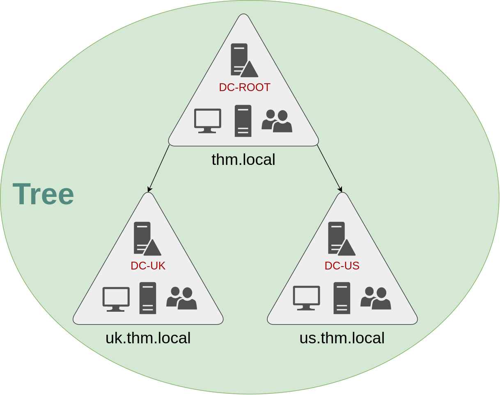
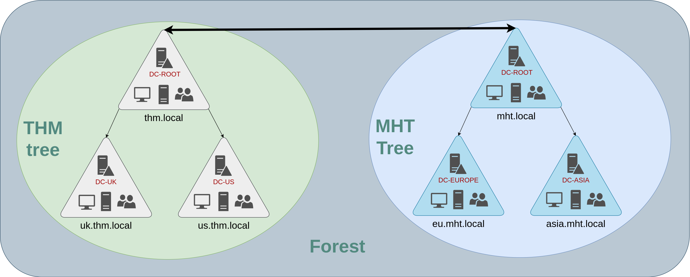

# Active Directory Basics

### Windows Domain

Centralise the administration of common components of a Windows computer network in a single 
repository called Active Directory

Domain Controller (DC) server running Active Directory (AD) services.

The main advantages of having a configured Windows domain are:

- Centralised identity management: All users across the network can be configured from Active 
Directory with minimum effort.

- Managing security policies: You can configure security policies directly from Active 
Directory and apply them to users and computers across the network as needed.

### Active Directory

The core of a Windows Domain is the Active Directory Domain Service (AD DS). It acts as a 
catalogue that holds the information of all the objects that exist on the network. The most 
common objects are: Users, groups, machines, printers and shares.

#### Users:

Users are one of the objects known as security principals, meaning that they can be 
authenticated by the domain and can be assigned privileges over resources like files or 
printers. You could say that a security principal is an object that can act upon resources in 
the network.

People: Users generally represent persons in your org who need to access the network.

Services: Every single service requires a user to run, but service users are different from 
regular users as they will only have the privileges needed to run their specific service.

#### Machines:

Machines are another type of object within Active Directory; for every computer that joins 
the Active Directory domain, a machine object will be created. Machines are also considered 
"security principals" and are assigned an account. This account has somewhat limited rights 
within the domain itself.

The machine accounts themselves are local administrators on the assigned computer, they are 
generally not supposed to be accessed by anyone except the computer itself, but as with any 
other account, if you have the password, you can use it to log in.

Note: Machine Account passwords are automatically rotated out and are generally comprised of 
120 random characters.

Machine accounts are suffixed with a `$`; A machine named DC01 will have a machine account 
called DC01$.

#### Security Groups

Define user groups to assign access rights to files or other resources to entire groups 
instead of single users. Users added to the group inherit all of the group's privileges. 

Security groups are also considered security principals and can have privileges over 
resources on the network.

Most important groups in a domain:

Domain Admins: Users of this group have administrative privileges over the entire domain. By 
default, they can administer any computer on the domain, including the DCs.

Server Operators: Users in this group can administer Domain Controllers. They cannot change 
any administrative group memberships.

Backup Operators: Users in this group are allowed to access any file, ignoring their 
permissions. They are used to perform backups of data on computers.

Account Operators: Users in this group can create or modify other accounts in the domain.

Domain Users: Includes all existing user accounts in the domain.

Domain Computers: Includes all existing computers in the domain.

Domain Controllers: Includes all existing DCs on the domain.

Complete list of security groups:
https://docs.microsoft.com/en-us/windows/security/identity-protection/access-control/active-directory-security-groups


#### Active Directory Users and Computers

To configure users, groups or machines in Active Directory log in to the DC and run Active 
Directory Users and Computers.

This will open a window showing the hierarchy of users, computers and groups that exist in 
the domain. These objects are organised in Organizational Units (OUs) which are container 
objects that allow you to classify users and machines. OUs are mainly used to define sets of 
users with similar policing requirements.

Default containers:

- Builtin: Contains default groups available to any Windows host.
- Computers: Any machine joining the network will be put here by default. You can move them 
if needed.
- Domain Controllers: Default OU that contains the DCs in your network.
- Users: Default users and groups that apply to a domain-wide context.
- Managed Service Accounts: Holds accounts used by services in your Windows domain.

#### Security Groups vs OUs

- OUs are handy for applying policies to users and computers, which include specific 
configurations that pertain to sets of users depending on their particular role in the 
enterprise. Remember, a user can only be a member of a single OU at a time, as it wouldn't 
make sense to try to apply two different sets of policies to a single user.

- Security Groups, on the other hand, are used to grant permissions over resources. For 
example, you will use groups if you want to allow some users to access a shared folder or 
network printer. A user can be a part of many groups, which is needed to grant access to 
multiple resources.

### Managing Users in AD

#### Deleting extra OUs and Users

To remove OUs which are protected by default, Advanced Features need to be enabled in the 
View menu.

#### Delegation

One of the things you can do in AD is to give specific users some control over some OUs. 
This process is known as delegation and allows you to grant users specific privileges to 
perform advanced tasks on OUs without needing a Domain Administrator to step in.

One of the most common use cases for this is granting IT support the privileges to reset 
other low-privilege users' passwords.

password reset command:
`Set-ADAccountPassword sophie -Reset -NewPassword (Read-Host -AsSecureString -Prompt 'New 
Password') -Verbose`

force password change on log on command:
`Set-ADUser -ChangePasswordAtLogon $true -Identity sophie -Verbose`

### Managing Computers in AD

Segregating devices according to use is a good starting point. In general you would expect 
to see machines divided into at least 3 categories:

1. Workstations
Workstations are one of the most common devices within an Active Directory domain. Each user 
in the domain will likely be logging into a workstation. This is the device they will use to 
do their work or normal browsing activities. These devices should never have a privileged 
user signed into them.

2. Servers
Servers are the second most common device within an Active Directory domain. Servers are 
generally used to provide services to users or other servers.

3. Domain Controllers
Domain Controllers are the third most common device within an Active Directory domain. 
Domain Controllers allow you to manage the Active Directory Domain. These devices are often 
deemed the most sensitive devices within the network as they contain hashed passwords for 
all user accounts within the environment.

### Group Policies

Group Policies allow us to deploy different policies for each OU individually. We can push 
different configurations and security baselines to users depending on their department.

Windows manages such policies through Group Policy Objects (GPO). GPOs are simply a 
collection of settings that can be applied to OUs. GPOs can contain policies aimed at either 
users or computers, allowing you to set a baseline on specific machines and identities.

#### Group Policy Management tool

GPOs are created under the Group Policy Objects dropdown of our domain. They are then linked 
to the desired OUs. Any sub-OUs will also be affected by the GPO.

You can apply Security Filtering to GPOs so that they are only applied to specific users/
computers under an OU. By default, they will apply to the Authenticated Users group, which 
includes all users/PCs.

The Settings tab is where we define Computer Configurations that apply only to computers and
User Configurations which apply only to users.

#### GPO Distribution


GPOs are distributed to the network via a network share called `SYSVOL`, which is stored in 
the DC. All users in a domain should typically have access to this share over the network to 
sync their GPOs periodically. The SYSVOL share points by default to the 
C:\Windows\SYSVOL\sysvol\ directory on each of the DCs in our network.

Once a change has been made to any GPOs, it might take up to 2 hours for computers to catch 
up. If you want to force a sync run this on the desired computer:
`gpupdate /force`

### Authentication Methods

All credentials are stored in the Domain Controllers. When a user tries to authenticate to a 
service using domain credentials the service needs to ask the Domain Controller if they7 are 
correct. There are two protocols used for network authentication in windows domains:

- Kerberos: Used by any recent version of Windows. This is the default protocol in any 
recent domain

- NetNTLM: Legacy authentication protocol kept for compatibility purposes

While NetNTLM should be considered obsolete, most networks will have both protocols enabled.

#### Kerberos Authentication

Users who log into a service using Kerberos will be assigned tickets. Think of tickets as 
proof of a previous authentication. Users with tickets can present them to a service to 
demonstrate they have already authenticated into the network before and are therefore 
enabled to use it.


When Kerberos is used for authentication, the following process happens:

**1. TGT Exchange**

The user sends their username and a timestamp encrypted using a key derived from their 
password to the **Key Distribution Center** (KDC), a service usually installed on the Domain 
Controller in charge of creating Kerberos tickets on the network.

The KDC will create and send back a **Ticket Granting Ticket** (TGT), which will allow the 
user to request additional tickets to access specific services. The need for a ticket to get 
more tickets may sound a bit weird, but it allows users to request service tickets without 
passing their credentials every time they want to connect to a service. Along with the TGT, 
a **Session Key** is given to the user, which they will need to generate the following 
requests.

Notice the TGT is encrypted using the krbtgt account's password hash, and therefore the user 
can't access its contents. 

*It is essential to know that the encrypted TGT includes a copy of the Session Key as part 
of its contents, and the KDC has no need to store the Session Key as it can recover a copy 
by decrypting the TGT if needed.*


Client: 
	- key derived from user's password hash
KDC: 
	- key derived from krbtgt password hash
	- key derived from user's password hash 

Client -> {username, timestamp} encrypted with user key, requests TGT -> KDC (DC)

KDC -> {TGT} encrypted with krbtgt key, {Session Key} encrypted with user key-> Client

**2. TGS Exchange**

When a user wants to connect to a service on the network like a share, website or 
database, they will use their TGT to ask the KDC for a **Ticket Granting Service** (TGS). 

TGS are tickets that allow connection only to the specific service they were created for. 

To request a TGS, the user will send their username and a timestamp encrypted using the 
Session Key, along with the TGT and a **Service Principal Name** (SPN), which indicates the 
service and server name we intend to access.

As a result, the KDC will send us a TGS along with a **Service Session Key**, which we will need to authenticate to the service we want to access. 

The TGS is encrypted using a key derived from the **Service Owner Hash**. The Service Owner 
is the user or machine account that the service runs under. The TGS contains a copy of the 
Service Session Key on its encrypted contents so that the Service Owner can access it by 
decrypting the TGS.


Client:
	- SK (Session Key)
	- TGT (Ticket Granting Ticket)
	- SPN (Service Principal Name = service and server name)

KDC:
	- key derived from krbtgt password hash
	- key derived from the Service Owner Hash

Client -> {username, timestamp} encrypted with SK, {TGT}, {SPN}, request TGS -> KDC

KDC -> {TGS} encrypted with Service Owner Hash, {Svc Session Key} encrypted with SK -> Client

**3. Authenticate To Service**

The TGS can then be sent to the desired service to authenticate and establish a 
connection. The service will use its configured account's password hash to decrypt the TGS 
and validate the Service Session Key.


Client:
	- SSK (Svc Session Key)
	- TGS

SRV:
	- key derived from the Service Owner Hash

Client -> {username, timestamp} encrypted with SSK, {TGS} encrypted with SOH, auth -> SRV

SRV -> decrypt TGS with SOH key and validate the SSK

#### NetNTLM


NetNTLM works using a challenge-response mechanism. The entire process is as follows:

1. The client sends an authentication request to the server they want to access.

2. The server generates a random number and sends it as a challenge to the client.

3. The client combines their NTLM password hash with the challenge (and other known data) to 
generate a response to the challenge and sends it back to the server for verification.

4. The server forwards the challenge and the response to the Domain Controller for 
verification.

5. The domain controller uses the challenge to recalculate the response and compares it to 
the original response sent by the client. If they both match, the client is authenticated; 
otherwise, access is denied. The authentication result is sent back to the server.

6. The server forwards the authentication result to the client.

Note that the user's password (or hash) is never transmitted through the network for 
security.

Note: The described process applies when using a domain account. If a local account is used, 
the server can verify the response to the challenge itself without requiring interaction 
with the domain controller since it has the password hash stored locally on its SAM.

### Trees, Forests and Trusts

#### Trees

Active Directory supports integrating multiple domains so that you can partition your 
network into units that can be managed independently. If you have two domains that share the 
same namespace (`thm.local` in our example), those domains can be joined into a Tree.

If our thm.local domain was split into two subdomains for UK and US branches, you could 
build a tree with a root domain of thm.local and two subdomains called `uk.thm.local` and 
`us.thm.local`, each with its AD, computers and users.



The partitioned structure gives us better control over who can access what in the domain.
The UK DC manages UK resources only and the US DC manages US resources only. Domain 
Administrators of each branch will have complete control over their respective DCs, but not 
other branches' DCs. Policies can also be configured independently for each domain in the 
tree.

A new security group needs to be introduced when talking about trees and forests. The 
**Enterprise Admins** group will grant a user administrative privileges over all of an 
enterprise's domains. Each domain would still have its Domain Admins with administrator 
privileges over their single domains and the Enterprise Admins who can control everything in 
the enterprise.

#### Forests

The union of several trees with different namespaces into the same network.



#### Trust Relationships

Trust relationships allow cross domain access. The simplest is a **one-way trust 
relationship** In a one-way trust, if `Domain AAA` trusts `Domain BBB`, this means that a 
user on BBB can be authorised to access resources on AAA.

```
				-- Trust Direction --> 
	DOMAIN AAA		 					DOMAIN BBB
				<-- Access Direction --
```

**Two-way trust relationships** can also be made to allow both domains to mutually authorise 
users from the other. By default, joining several domains under a tree or a forest will form 
a two-way trust relationship.

It is important to note that having a trust relationship between domains doesn't 
automatically grant access to all resources on other domains. Once a trust relationship is 
established, you have the chance to authorise users across different domains, but it's up to 
you what is actually authorised or not.
