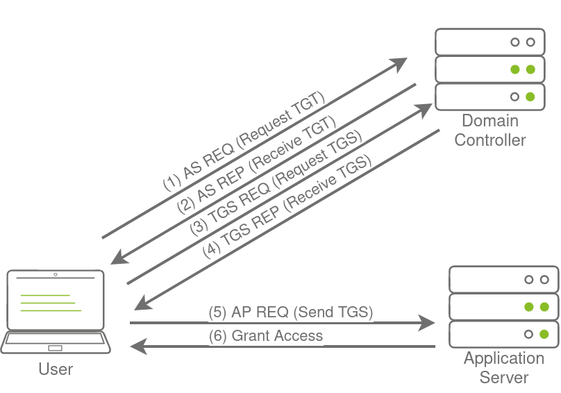

# Persisting Active Directory

### Persisitence Through Credentials

DA account: Administrator:tryhackmewouldnotguess1@:ZA

**DC Sync**

It is not sufficient to have a single domain controller per domain in large organisations. These domains are 
often used in multiple regional locations, and having a single DC would significantly delay any 
authentication services in AD. As such, these organisations make use of multiple DCs. The question then 
becomes, how is it possible for you to authenticate using the same credentials in two different offices?

The answer to that question is domain replication. Each domain controller runs a process called the Knowledge 
Consistency Checker (KCC). The KCC generates a replication topology for the AD forest and automatically 
connects to other domain controllers through Remote Procedure Calls (RPC) to synchronise information. This 
includes updated information such as the user's new password and new objects such as when a new user is 
created. This is why you usually have to wait a couple of minutes before you authenticate after you have 
changed your password since the DC where the password change occurred could perhaps not be the same one as 
the one where you are authenticating to.

The process of replication is called DC Synchronisation. It is not just the DCs that can initiate 
replication. Accounts such as those belonging to the Domain Admins groups can also do it for legitimate 
purposes such as creating a new domain controller.

A popular attack to perform is a DC Sync attack. If we have access to an account that has domain replication 
permissions, we can stage a DC Sync attack to harvest credentials from a DC.

**Not All Credentials Are Created Equal**

Before starting our DC Sync attack, let's first discuss what credentials we could potentially hunt for. While 
we should always look to dump privileged credentials such as those that are members of the Domain Admins 
group, these are also the credentials that will be rotated (a blue team term meaning to reset the account's 
password) first. As such, if we only have privileged credentials, it is safe to say as soon as the blue team 
discovers us, they will rotate those accounts, and we can potentially lose our access.

The goal then is to persist with near-privileged credentials. We don't always need the full keys to the 
kingdom; we just need enough keys to ensure we can still achieve goal execution and always make the blue team 
look over their shoulder. As such, we should attempt to persist through credentials such as the following:

- Credentials that have local administrator rights on several machines. Usually, organisations have a group 
or two with local admin rights on almost all computers. These groups are typically divided into one for 
workstations and one for servers. By harvesting the credentials of members of these groups, we would still 
have access to most of the computers in the estate.

- Service accounts that have delegation permissions. With these accounts, we would be able to force golden 
and silver tickets to perform Kerberos delegation attacks.

- Accounts used for privileged AD services. If we compromise accounts of privileged services such as 
Exchange, Windows Server Update Services (WSUS), or System Center Configuration Manager (SCCM), we could 
leverage AD exploitation to once again gain a privileged foothold.

When it comes to what credentials to dump and persist through, it is subject to many things. You will have to 
get creative in your thinking and take it on a case-by-case basis. 

**DC Sync All**

As a DA ssh into a jump server (THMWRK1) and start mimikatz

To perform a DC Sync of a single account:

`mimikatz # lsadump::dcsync /domain:za.tryhackme.loc /user:username`

To DC Sync every account, first enable logging:

```
mimikatz # log /path/to/log/file.txt
Using '/path/to/log/file.txt' for logfile: OK
```

Then run the above command, replacing `/user:` with `/all`

`mimikatz # lsadump::dcsync /domain:za.tryhackme.loc /all`

Once done, exit Mimikatz to finalise the dump find and then you can download the file. You can use 
`cat file.txt | grep "SAM Username"` to recover all the usernames and `cat file.txt | grep "Hash NTLM"` for 
all hashes. We can now either perform an offline password cracking attack to recover the plain text 
credentials or simply perform a pass the hash attack with Mimikatz.

### Persistence through Tickets

Persist through service accounts with delegation permissions to forge golden and silver tickets

**Tickets to the Chocolate Factory**

Normal flow for Kerberos Authentication



1. Request TGT - User makes an AS-REQ to the Key Distribution Centre (KDC) on the DC that includes a 
timestamp encrypted with the user's NTLM hash.

2. Receive TGT - The DC checks the information and sends the TGT to the user (AS-REP). This TGT is signed 
with the KRBTGT account's password hash that is only stored on the DC.

3. Request TGS - The user can now send this TGT to the DC to request a Ticket Granting Service (TGS) for the 
resource that the user wants to access (TGS-REQ).

4. Receive TGS - If the TGT checks out, the DC responds to the TGS that is encrypted with the NTLM hash of 
the service that the user is requesting access for (TGS-REP). 

5. Send TGS - The user presents the TGS to the service for access, which can verify the TGS since it knows 
its own hash (AP-REQ)

6. Grant Access - The service grants access to the user.

**Golden Tickets**

Golden Tickets are forged TGTs. What this means is we bypass steps 1 and 2 of the diagram above, where we 
prove to the DC who we are. Having a valid TGT of a privileged account, we can now request a TGS for almost 
any service we want.

In order to forge a golden ticket, we need the KRBTGT account's password hash so that we can sign a TGT for 
any user account we want. Some interesting notes about Golden Tickets:

- By injecting at this stage of the Kerberos process, we don't need the password hash of the account we want
to impersonate since we bypass that step. The TGT is only used to prove that the KDC on a DC signed it. 
Since it was signed by the KRBTGT hash, this verification process is declared valid no matter it's contents.

- Speaking of contents, the KDC will only validate the user account specified in the TGT if it is older than 
20 minutes. This means we can put a disabled, deleted, or non-existent account in the TGT, and it will be 
valid as long as we ensure the timestamp is not older than 20 minutes.

- Since the policies and rules for tickets are set in the TGT itself, we could overwrite the values pushed 
by the KDC, such as, for example, that tickets should only be valid for 10 hours. We could, for instance, 
ensure that our TGT is valid for 10 years, granting us persistence.

- By default, the KRBTGT account's password never changes, meaning once we have it, unless it is manually 
rotated, we have persistent access by generating TGTs forever.

- The blue team would have to rotate the KRBTGT account's password twice, since the current and previous 
passwords are kept valid for the account. This is to ensure that accidental rotation of the password does 
not impact services.

- Rotating the KRBTGT account's password is an incredibly painful process for the blue team since it will 
cause a significant amount of services in the environment to stop working. They think they have a valid TGT, 
sometimes for the next couple of hours, but that TGT is no longer valid. Not all services are smart enough 
to release the TGT is no longer valid (since the timestamp is still valid) and thus won't auto-request a new 
TGT.

- Golden tickets would even allow you to bypass smart card authentication, since the smart card is verified 
by the DC before it creates the TGT.

- We can generate a golden ticket on any machine, even one that is not domain-joined (such as our own attack 
machine), making it harder for the blue team to detect.

Apart from the KRBTGT account's password hash, we only need the **domain name**, **domain SID**, and **user ID** for the 
person we want to impersonate. If we are in a position where we can recover the KRBTGT account's password 
hash, we would already be in a position where we can recover the other pieces of the required information.

**Silver Tickets**

Silver Tickets are forged TGS tickets. So now, we skip all communication (Step 1-4 in the diagram above) we 
would have had with the KDC on the DC and just interface with the service we want access to directly. Some 
interesting notes about Silver Tickets:

- The generated TGS is signed by the machine account of the host we are targeting.

- The main difference between Golden and Silver Tickets is the number of privileges we acquire. If we have 
the KRBTGT account's password hash, we can get access to everything. With a Silver Ticket, since we only 
have access to the password hash of the machine account of the server we are attacking, we can only 
impersonate users on that host itself. The Silver Ticket's scope is limited to whatever service is targeted 
on the specific server.

- Since the TGS is forged, there is no associated TGT, meaning the DC was never contacted. This makes the 
attack incredibly dangerous since the only available logs would be on the targeted server. So while the 
scope is more limited, it is significantly harder for the blue team to detect.

- Since permissions are determined through SIDs, we can again create a non-existing user for our silver 
ticket, as long as we ensure the ticket has the relevant SIDs that would place the user in the host's local 
administrators group.

- The machine account's password is usually rotated every 30 days, which would not be good for persistence. 
However, we could leverage the access our TGS provides to gain access to the host's registry and alter the 
parameter that is responsible for the password rotation of the machine account. Thereby ensuring the machine 
account remains static and granting us persistence on the machine.

- While only having access to a single host might seem like a significant downgrade, machine accounts can be 
used as normal AD accounts, allowing you not only administrative access to the host but also the means to 
continue enumerating and exploiting AD as you would with an AD user account.

**Forging Tickets for Fun and Profit**

Use the AD-RSAT cmdlet to find the Domain SID:

`PS > Get-ADDomain`

Then create a golden ticket with mimikatz:

`mimikatz # kerberos::golden /admin:NotALegitAccount /domain:za.tryhackme.loc /id:500 /sid:<DOMAIN-SID> /krbtgt:<KRBTGT-HASH> /endin:600 /renewmax:10080 /ptt`

Paramters:

- /admin - The username we want to impersonate. This does not have to be a valid user.
- /domain - The FQDN of the domain we want to generate the ticket for.
- /id -The user RID. By default, Mimikatz uses RID 500, which is the default Administrator account RID.
- /sid -The SID of the domain we want to generate the ticket for.
- /krbtgt -The NTLM hash of the KRBTGT account.
- /endin - The ticket lifetime. By default, Mimikatz generates a ticket that is valid for 10 years. The 
default Kerberos policy of AD is 10 hours (600 minutes)
- /renewmax -The maximum ticket lifetime with renewal. By default, Mimikatz generates a ticket that is valid 
for 10 years. The default Kerberos policy of AD is 7 days (10080 minutes)
- /ptt - This flag tells Mimikatz to inject the ticket directly into the session, meaning it is ready to be 
used.

We can verify that the golden ticket is working by running the dir command against the domain controller:

`dir \\thmdc.za.tryhackme.loc\c$\`

To create a silver ticket:

`mimikatz # kerberos::golden /admin:NotALegitAccount /domain:za.tryhackme.loc /id:500 /sid:<DOMAIN-SID> /target:<TARGET-HOSTNAME> /rc4:<TARGET-NTLM-HASH> /service:cifs /ptt`

Parameters:

- /admin - The username we want to impersonate. This does not have to be a valid user.
- /domain - The FQDN of the domain we want to generate the ticket for.
- /id -The user RID. By default, Mimikatz uses RID 500, which is the default Administrator account RID.
- /sid -The SID of the domain we want to generate the ticket for.
- /target - The hostname of our target server. Let's do THMSERVER1.za.tryhackme.loc, but it can be any 
domain-joined host.
- /rc4 - The NTLM hash of the machine account of our target. Look through your DC Sync results for the NTLM 
hash of THMSERVER1$. The $ indicates that it is a machine account.
- /service - The service we are requesting in our TGS. CIFS is a safe bet, since it allows file access.
- /ptt - This flag tells Mimikatz to inject the ticket directly into the session, meaning it is ready to be 
used.

We can verify that the silver ticket is working by running the dir command against the target:

`dir \\THMSERVER1.za.tryhackme.loc\c$\`

### Persistence Through Certificates

**The Return of AD CS**

We leveraged certificates to become Domain Admins but they can also be used for persistence. All we need is 
a valid certificate that can be used for Client Authentication. This will allow us to use the certificate to 
request a TGT. 

We can continue requesting TGTs no matter how many rotations they do on the account we are attacking. The 
only way we can be kicked out is if they revoke the certificate we generated or if it expires. Meaning we 
probably have persistent access by default for roughly the next 5 years. 

Depending on our access, we can take it another step further. We could simply steal the private key of the 
root CA's certificate to generate our own certificates whenever we feel like it. Even worse, since these 
certificates were never issued by the CA, the blue team has no ability to revoke them. This would be even 
worse for the blue team since it would mean a rotation of the CA, meaning all issued certificates would have 
to be revoked by the blue team to kick us out.

**Extracting the Private Key**

The private key of the CA is stored on the CA server itself. If the private key is not protected through 
hardware-based protection methods such as an Hardware Security Module (HSM), which is often the case for 
organisations that just use Active Directory Certificate Services (AD CS) for internal purposes, it is 
protected by the machine Data Protection API (DPAPI).

This means we can use tools such as Mimikatz and SharpDPAPI to extract the CA certificate and thus the 
private key from the CA. Mimikatz is the simplest tool to use, but if you want to experience other tools, 
[have a look here](https://pentestlab.blog/2021/11/15/golden-certificate/).

Extract the certificates from the DC with mimikatz:
`mimikatz # crypto::certificates /systemstore:local_machine `

Certificates from THMDC

```
 * System Store  : 'local_machine' (0x00020000)            
 * Store         : 'My'                                    
                                                           
 0.                                                        
    Subject  :                                             
    Issuer   : DC=loc, DC=tryhackme, DC=za, CN=za-THMDC-CA 
    Serial   : 040000000000703a4d78090a0ab10400000010      
    Algorithm: 1.2.840.113549.1.1.1 (RSA)                  
    Validity : 4/27/2022 8:32:43 PM -> 4/27/2023 8:32:43 PM                                    
    Hash SHA1: d6a84e153fa326554f095be4255460d5a6ce2b39                                        
        Key Container  : dbe5782f91ce09a2ebc8e3bde464cc9b_32335b3b-2d6f-4ad7-a061-b862ac75bcb1 
        Provider       : Microsoft RSA SChannel Cryptographic Provider                         
        Provider type  : RSA_SCHANNEL (12)                                                      
        Type           : AT_KEYEXCHANGE (0x00000001)                                            
        |Provider name : Microsoft RSA SChannel Cryptographic Provider                          
        |Key Container : te-DomainControllerAuthentication-5ed52c94-34e8-4450-a751-a57ac55a110f 
        |Unique name   : dbe5782f91ce09a2ebc8e3bde464cc9b_32335b3b-2d6f-4ad7-a061-b862ac75bcb1               
        |Implementation: CRYPT_IMPL_SOFTWARE ;                                                               
        Algorithm      : CALG_RSA_KEYX                                                                       
        Key size       : 2048 (0x00000800)                                                                   
        Key permissions: 0000003b ( CRYPT_ENCRYPT ; CRYPT_DECRYPT ; CRYPT_READ ; CRYPT_WRITE ; CRYPT_MAC ; ) 
        Exportable key : NO                                                                                  

 1. za-THMDC-CA                                            
    Subject  : DC=loc, DC=tryhackme, DC=za, CN=za-THMDC-CA 
    Issuer   : DC=loc, DC=tryhackme, DC=za, CN=za-THMDC-CA 
    Serial   : 90e157dae304ef429824a33d3a3ef91e            
    Algorithm: 1.2.840.113549.1.1.1 (RSA)                  
    Validity : 4/27/2022 7:58:15 PM -> 4/27/2027 8:08:09 PM      
    Hash SHA1: c12fcb4b88467854b3d4d7f762adb50b0fd8346e          
        Key Container  : za-THMDC-CA                             
        Provider       : Microsoft Software Key Storage Provider 
        Provider type  : cng (0)                                 
        Type           : CNG Key (0xffffffff)                                                  
        |Provider name : Microsoft Software Key Storage Provider                               
        |Implementation: NCRYPT_IMPL_SOFTWARE_FLAG ;                                           
        Key Container  : za-THMDC-CA                                                           
        Unique name    : 8d666f3049de45dee20c70510f66d2cf_32335b3b-2d6f-4ad7-a061-b862ac75bcb1 
        Algorithm      : RSA                                                                          
        Key size       : 2048 (0x00000800)                                                            
        Export policy  : 00000003 ( NCRYPT_ALLOW_EXPORT_FLAG ; NCRYPT_ALLOW_PLAINTEXT_EXPORT_FLAG ; ) 
        Exportable key : YES                                                                          
        LSA isolation  : NO                                                                           
                                                                                                      
 2. THMDC.za.tryhackme.loc                                                                            
    Subject  : CN=THMDC.za.tryhackme.loc
    Issuer   : DC=loc, DC=tryhackme, DC=za, CN=za-THMDC-CA 
    Serial   : 03000000000057c6f9be06e7c78d0300000010
    Algorithm: 1.2.840.113549.1.1.1 (RSA)
    Validity : 4/27/2022 8:32:43 PM -> 4/27/2023 8:32:43 PM
    Hash SHA1: a0e69ecef166b2d785a1b7d615ff730819443d42
        Key Container  : 520b5ca0aec81961ad476939c6792c13_32335b3b-2d6f-4ad7-a061-b862ac75bcb1
        Provider       : Microsoft RSA SChannel Cryptographic Provider
        Provider type  : RSA_SCHANNEL (12)
        Type           : AT_KEYEXCHANGE (0x00000001)
        |Provider name : Microsoft RSA SChannel Cryptographic Provider
        |Key Container : te-DomainController-ccb1e691-6606-40a3-a87a-f549bdcd757c
        |Unique name   : 520b5ca0aec81961ad476939c6792c13_32335b3b-2d6f-4ad7-a061-b862ac75bcb1
        |Implementation: CRYPT_IMPL_SOFTWARE ;
        Algorithm      : CALG_RSA_KEYX 
        Key size       : 2048 (0x00000800)
        Key permissions: 0000003b ( CRYPT_ENCRYPT ; CRYPT_DECRYPT ; CRYPT_READ ; CRYPT_WRITE ; CRYPT_MAC ; ) 
        Exportable key : NO

 3.
    Subject  :
    Issuer   : DC=loc, DC=tryhackme, DC=za, CN=za-THMDC-CA
    Serial   : 02000000000078856466521a82570200000010 
    Algorithm: 1.2.840.113549.1.1.1 (RSA)
    Validity : 4/27/2022 8:32:18 PM -> 4/27/2023 8:32:18 PM 
    Hash SHA1: 0d43237c50ccb446a07572545b5b4c8cf517682a
        Key Container  : 544fc312c893025e32795e06e74c4517_32335b3b-2d6f-4ad7-a061-b862ac75bcb1 
        Provider       : Microsoft RSA SChannel Cryptographic Provider
        Provider type  : RSA_SCHANNEL (12)
        Type           : AT_KEYEXCHANGE (0x00000001) 
        |Provider name : Microsoft RSA SChannel Cryptographic Provider
        |Key Container : te-KerberosAuthentication-21e4d1ee-54f7-4ca5-b36b-b2cecff9a609 
        |Unique name   : 544fc312c893025e32795e06e74c4517_32335b3b-2d6f-4ad7-a061-b862ac75bcb1
        |Implementation: CRYPT_IMPL_SOFTWARE ;
        Algorithm      : CALG_RSA_KEYX
        Key size       : 2048 (0x00000800)
        Key permissions: 0000003b ( CRYPT_ENCRYPT ; CRYPT_DECRYPT ; CRYPT_READ ; CRYPT_WRITE ; CRYPT_MAC ; ) 
        Exportable key : NO
```

The above private keys aren't exportable, luckily mimikatz allows us to patch memory to make them exportable

```
mimikatz # privilege::debug
Privilege '20' OK

mimikatz # crypto::capi
Local CryptoAPI RSA CSP patched
Local CryptoAPI DSS CSP patched

mimikatz # crypto::cng
"KeyIso" service patched

```

With these services patched, we can use Mimikatz to export the certificates:

`mimikatz # crypto::certificates /systemstore:local_machine /export`

The exported certificates will be stored in both PFX and DER format to disk

**Generating our own Certificates**

Now that we have the private key and root CA certificate, we can use the [SpectorOps ForgeCert](https://github.com/GhostPack/ForgeCert) tool to 
forge a Client Authenticate certificate for any user we want.

Generate a new certificate:

`ForgeCert.exe --CaCertPath za-THMDC-CA.pfx --CaCertPassword mimikatz --Subject CN=User --SubjectAltName Administrator@za.tryhackme.loc --NewCertPath fullAdmin.pfx --NewCertPassword Password123`

Parameters explained:

- CaCertPath - The path to our exported CA certificate.
- CaCertPassword - The password used to encrypt the certificate. By default, Mimikatz assigns the password 
of mimikatz.
- Subject - The subject or common name of the certificate. This does not really matter in the context of 
what we will be using the certificate for.
- SubjectAltName - This is the User Principal Name (UPN) of the account we want to impersonate with this 
certificate. It has to be a legitimate user.
- NewCertPath - The path to where ForgeCert will store the generated certificate.
- NewCertPassword - Since the certificate will require the private key exported for authentication purposes, 
we must set a new password used to encrypt it.

We can use Rubeus to request a TGT using the certificate to verify that the certificate is trusted. We will 
use the following command:

`Rubeus.exe asktgt /user:Administrator /enctype:aes256 /certificate:<PATH-TO-CERT> /password:<CERT-PASSWORD> /outfile:<TGT-OUTFILE> /domain:za.tryhackme.loc /dc:<DC-IP>`

Use Mimikatz to load the TGT and authenticate to THMDC:

```
mimikatz # kerberos::ptt adminTGT.kirbi

* File: 'adminTGT': OK

C:\>dir \\thmdc.za.tryhackme.loc\c$\
```

**We Are No Longer Friends With The Blue Team**

Certificate persistence is significantly harder to defend against. Even if you rotate the credentials of the 
compromised account, the certificate will still be valid. The only way to remove the persistence is to issue 
a revocation of the certificate. However, this would only be possible if we generated the certificate 
through legitimate channels. Since we exported the CA and generated the certificate ourselves, it does not 
appear on AD CS's list of issued certificates, meaning the blue team will not be able to revoke our 
certificate.

So what's the only solution to remove the persistence? Well, this is why we are no longer friends. They will 
have to revoke the root CA certificate. But revoking this certificate means that all certificates issued by 
AD CS would all of a sudden be invalid. Meaning they will have to generate a new certificate for every 
system that uses AD CS. You should start to see why this type of persistence is incredibly dangerous and 
would require full rebuilds of systems if performed.

### Persisitence through SID History
