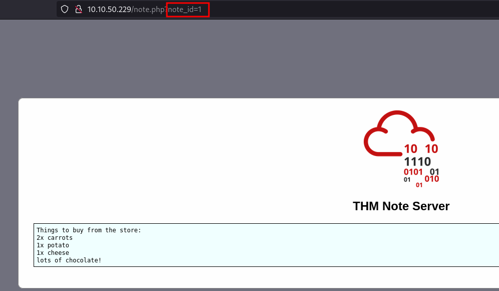
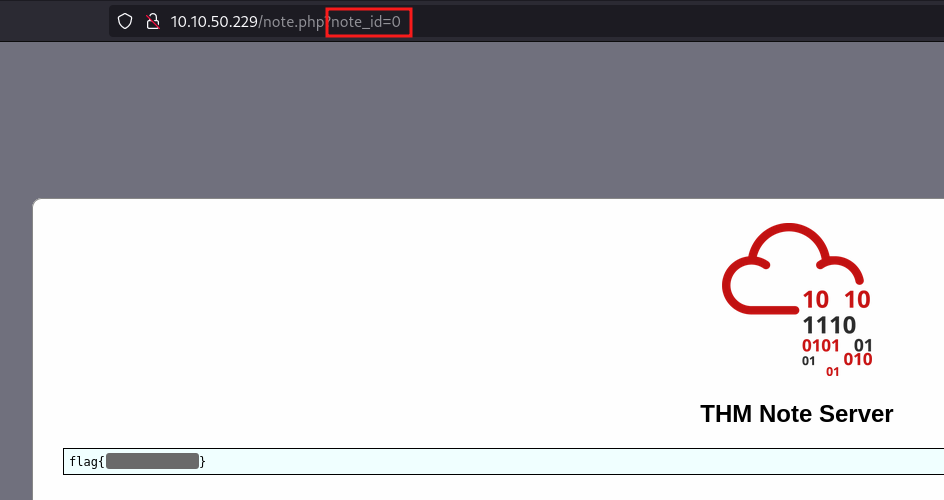
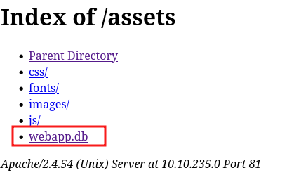
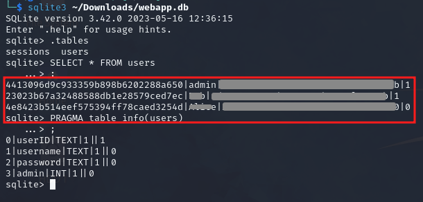
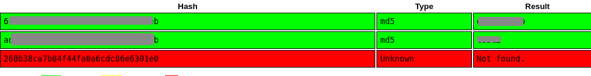
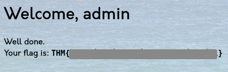
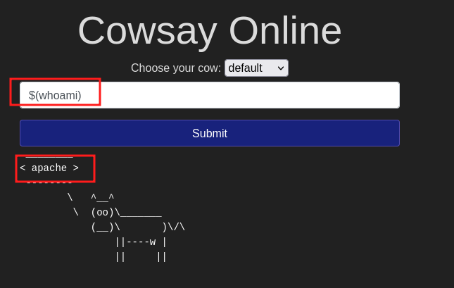
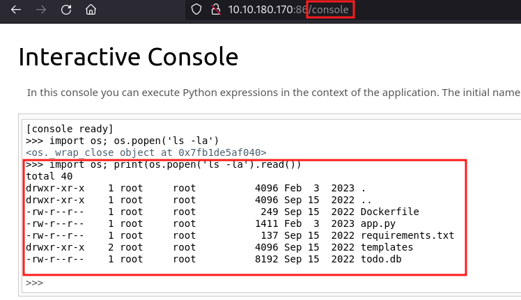
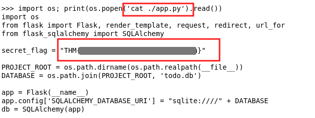

# OWASP Top 10 - 2021

### 1. Broken Access Control

Access controls prevent users accessing content they are not authorized to access, Broken Access Control 
allows users to bypass authorisation.

YouTube private video access example: https://bugs.xdavidhu.me/google/2021/01/11/stealing-your-private-videos-one-frame-at-a-time/

**IDOR Challenge**

IDOR or Insecure Direct Object Reference refers to an access control vulnerability where you can access 
resources you wouldn't ordinarily be able to see. This occurs when the programmer exposes a Direct Object 
Reference, which is just an identifier that refers to specific objects within the server. Direct object 
references aren't the problem, lack of validation in the application is.

In the challenge the `note_id` parameter is vulnerable to IDOR

By changing the value of `note_id` we can see other users notes

### 2. Cryptographic Failures

Misuse or lack of cryptographic algorithms for protecting sensitive information. Encrypting data in transit
prevents eavesdropping of network packets, encrypting data at rest prevents data stored in servers from being
read.

Examples of cryptographic failures:
- accidental sensitive data exposure in a web app
- weak encryption on data intercepted in Man in The Middle Attacks or data breaches

**Cryptographic Failure Challenge**

The login.php source contains a comment mentioning the app DB is stored in /assets

We can download and view the users table with sqlite3 giving us all usernames and password hashes

Using crackstation we can crack 2 of the 3 hashes, one of them is the admin user's password

Logging in as admin gives us the flag

### 3. Injection

Injection flaws happen when user input is used for parameters or commands within the application.
Injection attacks depend on what technologies are used and how these technologies interpret the input.

Some common examples include:

- SQL Injection: This occurs when user-controlled input is passed to SQL queries. An attacker can pass in SQL 
queries to manipulate the outcome of such queries. This could potentially allow the attacker to access, 
modify and delete information in a database when this input is passed into database queries.

- Command Injection: This occurs when user input is passed to system commands. An attacker can execute 
arbitrary system commands on application servers.

The main defence for preventing injection attacks is ensuring that user-controlled input is not interpreted 
as queries or commands.

- Using an allow list: Input is compared to a list of safe inputs or characters. If the input is safe, then 
it is processed. Otherwise it's rejected by the application.
- Stripping input: If the input contains dangerous characters, they are removed before processing.

**Command Injection**

Using Cowsay online we can execute inline commands `$(command)` on the target

### 4. Insecure Design

Insecure design refers to vulnerabilities which are inherent to the application's architecture. They are not 
vulnerabilities regarding bad implementations or configurations, but the idea behind the whole application 
(or a part of it) is flawed from the start.

Insecure Password Reset example: https://thezerohack.com/hack-any-instagram

**Insecure password Reset Practical**

We can reset a user's password by answering security questions

There is no limit on the number of tries to answer a given question so we can bruteforce the "What is your 
favourite colour?" question to reset joseph's password and obtain the flag

### 5. Security Misconfiguration

Security misconfigurations are a lack of appropriate configuration.

- Poorly configured permissions on cloud services (S3 buckets)
- Having unnecessary features enabled, like services, pages, accounts or privileges
- Default accounts and passwords
- Error messages that are overly detailed and allow the attacker to find out more about the system
- Not using HTTP security headers

**Debugging Interfaces**

A common security misconfiguration concerns the exposure of debugging features in production software. 

Werkzeug panel in [Patreon 2015 hack](https://labs.detectify.com/2015/10/02/how-patreon-got-hacked-publicly-exposed-werkzeug-debugger/)

**Practical Example**

The target has an exposed Werkzeug debugging console, allowing code execution on the server

We can view the source code to grab the flag

### 6. Vulnerable and Outdated Components
