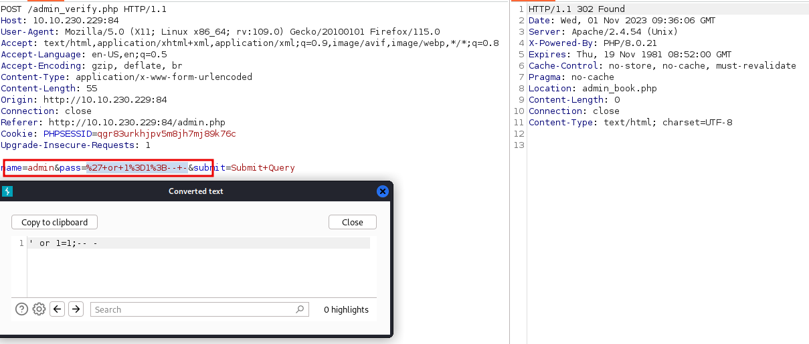
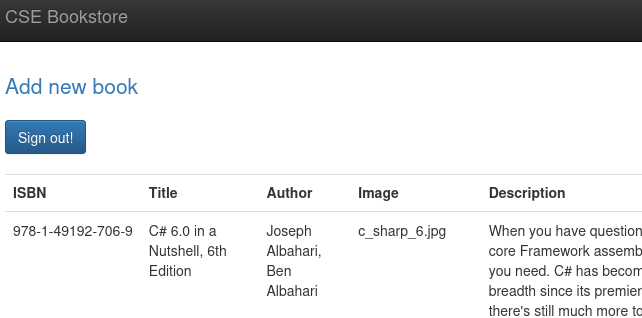
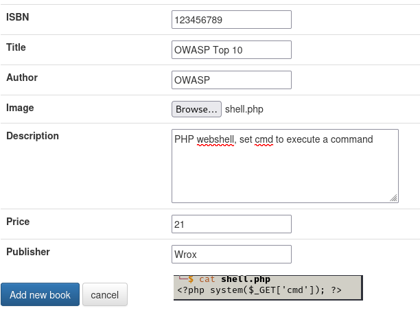
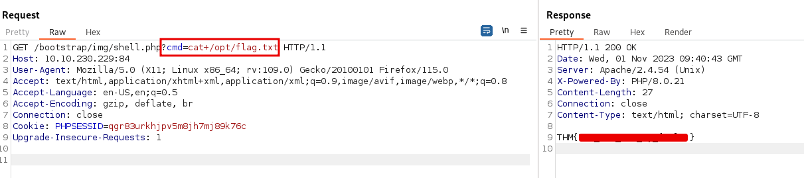
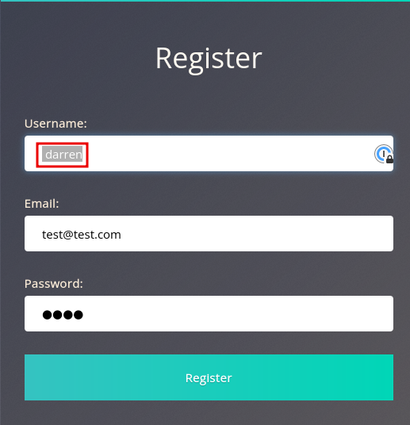
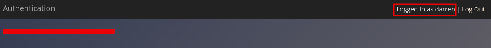
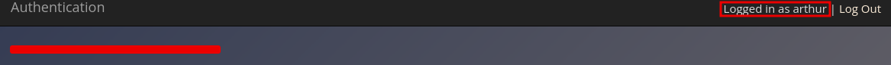
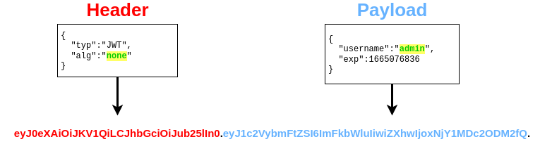
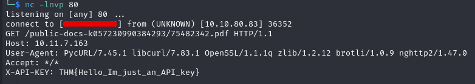
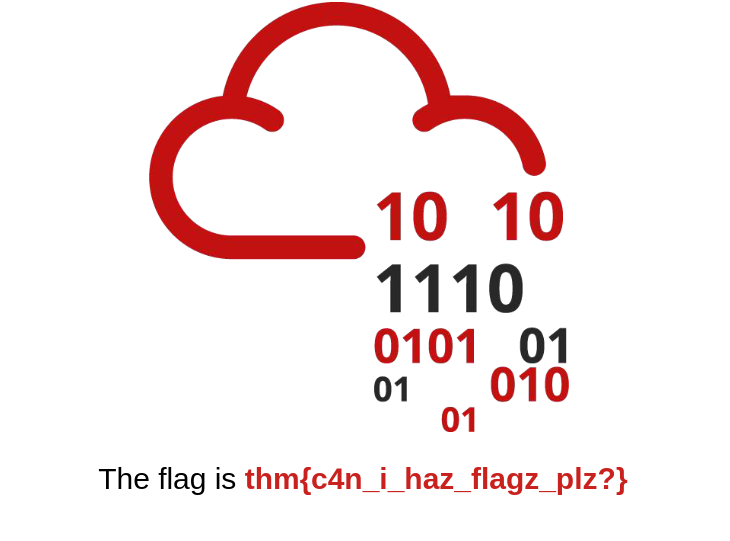

# OWASP Top 10 - 2021

1. Broken Access Control
2. Cryptographic Failures
3. Injection
4. Insecure Design
5. Security Misconfigurations
6. Vulnerable and Outdated Components
7. Identification and Authentication Failures
8. Software and Data Integrity Failures
9. Security Logging and Monitoring Failures
10. Server-Side Request Forgery (SSRF)

### 1. Broken Access Control

Access controls prevent users accessing content they are not authorized to access, Broken Access Control 
allows users to bypass authorisation.

YouTube private video access example: https://bugs.xdavidhu.me/google/2021/01/11/stealing-your-private-videos-one-frame-at-a-time/

**IDOR Challenge**

IDOR or Insecure Direct Object Reference refers to an access control vulnerability where you can access 
resources you wouldn't ordinarily be able to see. This occurs when the programmer exposes a Direct Object 
Reference, which is just an identifier that refers to specific objects within the server. Direct object 
references aren't the problem, lack of validation in the application is.

In the challenge the `note_id` parameter is vulnerable to IDOR

By changing the value of `note_id` we can see other users notes

### 2. Cryptographic Failures

Misuse or lack of cryptographic algorithms for protecting sensitive information. Encrypting data in transit
prevents eavesdropping of network packets, encrypting data at rest prevents data stored in servers from being
read.

Examples of cryptographic failures:
- accidental sensitive data exposure in a web app
- weak encryption on data intercepted in Man in The Middle Attacks or data breaches

**Cryptographic Failure Challenge**

The login.php source contains a comment mentioning the app DB is stored in /assets

We can download and view the users table with sqlite3 giving us all usernames and password hashes

Using crackstation we can crack 2 of the 3 hashes, one of them is the admin user's password

Logging in as admin gives us the flag

### 3. Injection

Injection flaws happen when user input is used for parameters or commands within the application.
Injection attacks depend on what technologies are used and how these technologies interpret the input.

Some common examples include:

- SQL Injection: This occurs when user-controlled input is passed to SQL queries. An attacker can pass in 
SQL queries to manipulate the outcome of such queries. This could potentially allow the attacker to access, 
modify and delete information in a database when this input is passed into database queries.

- Command Injection: This occurs when user input is passed to system commands. An attacker can execute 
arbitrary system commands on application servers.

The main defence for preventing injection attacks is ensuring that user-controlled input is not interpreted 
as queries or commands.

- Using an allow list: Input is compared to a list of safe inputs or characters. If the input is safe, then 
it is processed. Otherwise it's rejected by the application.
- Stripping input: If the input contains dangerous characters, they are removed before processing.

**Command Injection**

Using Cowsay online we can execute inline commands `$(command)` on the target

### 4. Insecure Design

Insecure design refers to vulnerabilities which are inherent to the application's architecture. They are not 
vulnerabilities regarding bad implementations or configurations, but the idea behind the whole application 
(or a part of it) is flawed from the start.

Insecure Password Reset example: https://thezerohack.com/hack-any-instagram

**Insecure password Reset Practical**

We can reset a user's password by answering security questions

There is no limit on the number of tries to answer a given question so we can bruteforce the "What is your 
favourite colour?" question to reset joseph's password and obtain the flag

### 5. Security Misconfiguration

Security misconfigurations are a lack of appropriate configuration.

- Poorly configured permissions on cloud services (S3 buckets)
- Having unnecessary features enabled, like services, pages, accounts or privileges
- Default accounts and passwords
- Error messages that are overly detailed and allow the attacker to find out more about the system
- Not using HTTP security headers

**Debugging Interfaces**

A common security misconfiguration concerns the exposure of debugging features in production software. 

Werkzeug panel in [Patreon 2015 hack](https://labs.detectify.com/2015/10/02/how-patreon-got-hacked-publicly-exposed-werkzeug-debugger/)

**Practical Example**

The target has an exposed Werkzeug debugging console, allowing code execution on the server

We can view the source code to grab the flag

### 6. Vulnerable and Outdated Components

Vulnerabilities for older versions of software that are well known, and easily exploitable as a result.

**Vulnerable and Outdated Components Lab**

The target app is vulnerable to SQLi in the password parameter in the admin login page

Admin Book List

Using the /admin_add.php page we can upload a PHP webshell

Set cmd to cat and get the flag

### 7. Identification and Authentication Failures

Common flaws in authentication mechanisms:

- Brute force attacks: If a web application uses usernames and passwords, an attacker can try to launch 
brute force attacks that allow them to guess the username and passwords using multiple authentication 
attempts.  
- Use of weak credentials: Web applications should set strong password policies.  
- Weak Session Cookies: Session cookies are how the server keeps track of users. If session cookies contain 
predictable values, attackers can set their own session cookies and access users' accounts.  

Mitigations for broken authentication mechanisms:

- To avoid password-guessing attacks, ensure the application enforces a strong password policy.  
- To avoid brute force attacks, ensure that the application enforces an automatic lockout after a certain 
number of attempts.  
- Implement Multi-Factor Authentication.  

**Identification and Authentication Failures Practical**

Using user re-registration to exploit a flaw in the authentication mechanism

Register as darren adding a space in front, then login with the newly created password

Register as arthur adding a space in front, then login with the newly created password

### 8. Software and Data Integrity Failures

**What is Integrity?**

Integrity in cyber security means data is complete, trustworthy and has not been modified or accidentally 
altered by an unauthorised user. You will often see a hash sent alongside the file so that you can prove 
that the file you downloaded kept its integrity and wasn't modified in transit.

**Software and Data Integrity Failures**

This vulnerability arises from code or infrastructure that uses software or data without using any kind of 
integrity checks. Since no integrity verification is being done, an attacker might modify the software or 
data passed to the application, resulting in unexpected consequences. 

There are typically two types of vulnerabilities in this category:

- Data Integrity Failures
- Software Integrity Failures

**Software Integrity Failures**

Failure to verify third party library URL hashes before loading the content can lead to software integrity 
failures. Use Subresource Integrity (SRI) to check the integrity of a given source, generate hashes with 
https://www.srihash.org/ and add an integrity hash to the HTML:

``

**Data Integrity Failures**

A data integrity failure vulnerability was present on some libraries implementing JWTs a while ago. As we 
have seen, JWT implements a signature to validate the integrity of the payload data. The vulnerable 
libraries allowed attackers to bypass the signature validation by changing the two following things in a JWT:

1. Modify the header section of the token so that the alg header would contain the value none.
2. Remove the signature part.

### 9. Security Logging and Monitoring Failures

When web applications are set up, every action performed by the user should be logged. Logging is important 
because, in the event of an incident, the attackers' activities can be traced. Once their actions are 
traced, their risk and impact can be determined.

The more significant impacts of these include:

- Regulatory damage: if an attacker has gained access to personally identifiable user information and there 
is no record of this, final users are affected, and the application owners may be subject to fines or more 
severe actions depending on regulations.

- Risk of further attacks: an attacker's presence may be undetected without logging. This could allow an 
attacker to launch further attacks against web application owners by stealing credentials, attacking 
infrastructure and more.

The information stored in logs should include the following:

- HTTP status codes
- Time Stamps
- Usernames
- API endpoints/page locations
- IP addresses

The ideal case is to have monitoring in place to detect any suspicious activity. The aim of detecting
suspicious activity is to either stop the attacker completely or reduce the impact they've made if their
presence has been detected much later than anticipated. 

Common examples of suspicious activity include:

- Multiple unauthorised attempts for a particular action (usually authentication attempts or access to 
unauthorised resources, e.g. admin pages)

- Requests from anomalous IP addresses or locations: while this can indicate that someone else is trying to 
access a particular user's account, it can also have a false positive rate.

- Use of automated tools: particular automated tooling can be easily identifiable, e.g. using the value of 
User-Agent headers or the speed of requests. This can indicate that an attacker is using automated tooling.

- Common payloads: in web applications, it's common for attackers to use known payloads. Detecting the use 
of these payloads can indicate the presence of someone conducting unauthorised/malicious testing on 
applications.

### 10. Server-Side Request Forgery (SSRF)

SSRF occurs when an attacker can coerce a web application into sending requests on their behalf to arbitrary 
destinations while having control of the contents of the request itself. SSRF vulnerabilities often arise 
from implementations where our web application needs to use third-party services. 

**Practical Example**

Navigating to the page shows us a download link vulnerable to SSRF

If we start a netcat listener and replace the file storage URL with our IP we can grab any headers:

**Extra credit**

To gain access to the admin panel we can use SSRF to grab the /admin page

Escape the ID param with URL encoded `#` which is `%23`

http://10.10.80.83:8087/download?server=http://localhost:8087/admin%23&id=75482342

