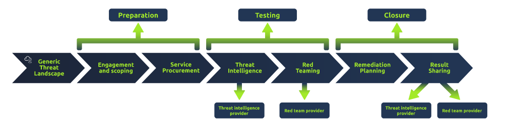

# Red Team Threat Intel

### What is Threat Intelligence

Cyber Threat Intelligence (CTI)
Indicators of Compromise (IOC)
Information and Sharing Analysis Centers (ISACs)

CTI can be consumed by collecting IOCs and TTPs distributed and maintained by ISACs

Defenders use threat intelligence to provide context to the ever-changing threat landscape and quantify 
findings. IOCs are quantified by traces left by adversaries such as domains, IPs, files, strings, etc. 
The blue team can utilize various IOCs to build detections and analyze behavior.

From a red team perspective, you can think of threat intelligence as the red team's analysis of the blue 
team's ability to properly leverage CTI for detections.

### Applying Threat Intel to the Red Team

Leverage CTI to emulate adversaries

Threat intel platforms and frameworks:

- [MITRE ATT&CK](https://attack.mitre.org/)
- [TIBER-EU](https://www.ecb.europa.eu/paym/cyber-resilience/tiber-eu/html/index.en.html)
- [OST Map](https://www.intezer.com/ost-map/)

Select an adversary, identify TTPs of the chosen adversary, and map them to a known cyber kill chain

### The TIBER-EU Framework

Threat Intelligence-based Ethical Red Teaming (TIBER), developed by the European Central Bank

Links:

- [TIBER-EU white paper](https://www.ecb.europa.eu/pub/pdf/other/ecb.tiber_eu_framework.en.pdf)
- [CREST description](https://www.crest-approved.org/membership/tiber-eu/)

### TTP Mapping

Collect adversary TTPs using threat intel frameworks and then map them to the steps of the chosen cyber 
kill chain

Choose an adversary based on:

1. Target industry
2. Employed attack vectors
3. Country of origin
4. Other factors
