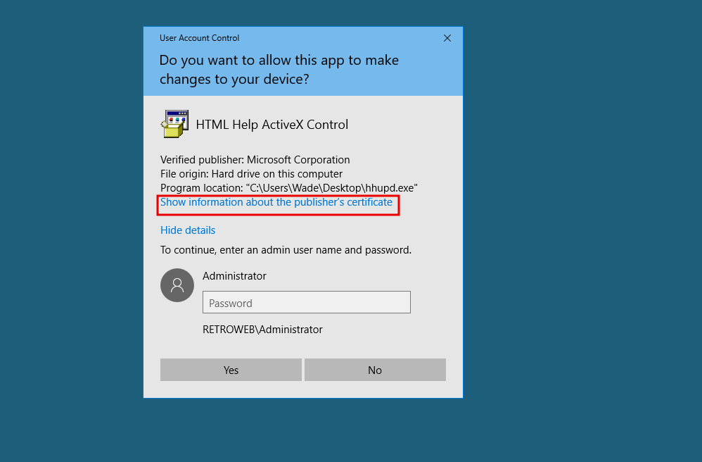
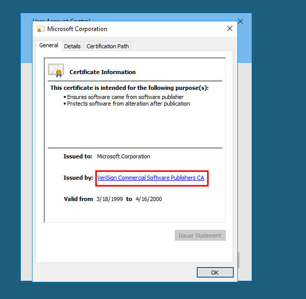
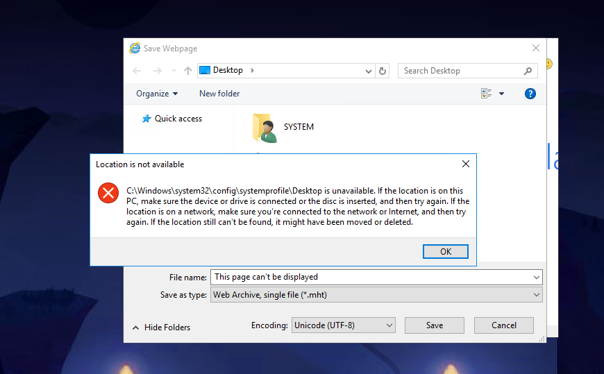
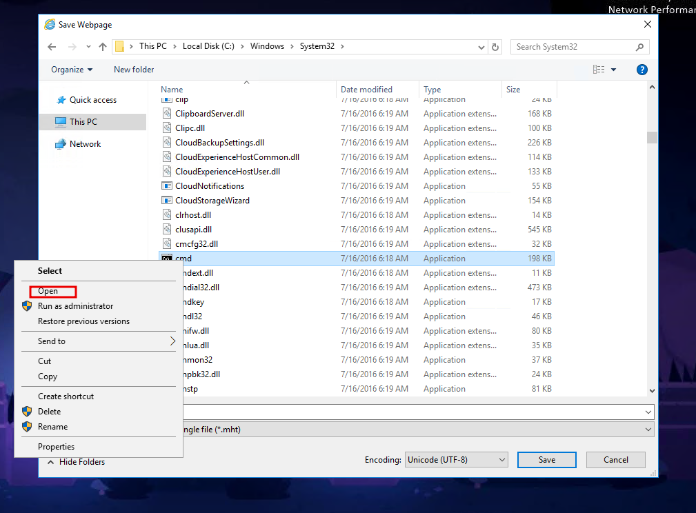
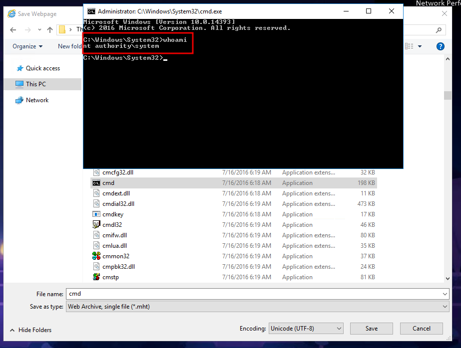

# Blaster

### Reconnaissance

- port 80/tcp HTTP Microsoft IIS httpd 10.0
- port 3389/tcp RDP/Microsoft Terminal Services

Directory scanning shows /retro

Reading the blog posts, Wade writes that he mistypes the avatar's name of the character from Ready Player One
when logging in. A quick google search shows the characters avatar is called parzival. Wade has also left a 
comment on the blog post to remind himself of the spelling of parzival :facepalm:

### Exploitation

RDP login with Wade's credentials

The target is vulnerable to CVE-2019-1388, internet explorer history should show searches for CVE-2019-1388 
but it didn't here.

The exe was also on the desktop when it should be in the Recycle Bin

### Prvilege Escalation

Executing the hhupd binary opens up UAC and asks for admin credentials

Clicking on the certificate link opens Internet Explorer as System

Exiting the UAC window shows that IE has tried to load the certificate url

Saving the page opens explorer and should show a Location is not available error message

We can enter `C:\Windows\System32\*.*` as the File name to access System32

Right clicking on cmd.exe allows us to open a System cmd prompt

